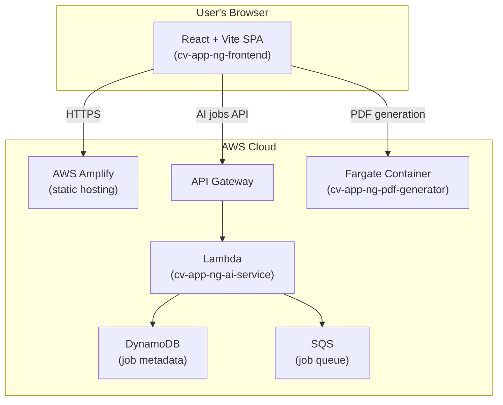
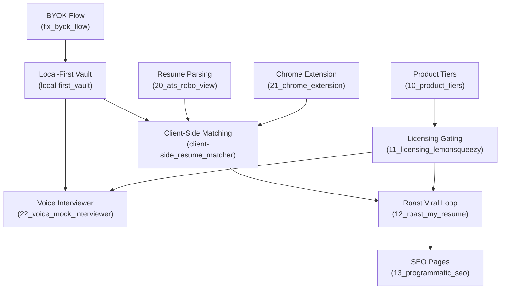

# Master Roadmap: Strategy → Implementation → Execution

## Purpose

This roadmap ties together:

- **Strategy docs** (market analysis, monetization, AWS blueprint)
- **Implementation basis docs** (`docs/implementation-plan/01–07`) for Cursor planning
- **Execution plans** (`.cursor/plans/*.plan.md`) for concrete code changes

It serves as the **entry point** for agents working on the codebase, ensuring they understand what exists today vs what's aspirational.

## Three-Tier Documentation Architecture

```javascript
┌─────────────────────────────────────────────────────────────────┐
│  STRATEGY LAYER (Why & What)                                    │
│  - AI Resume Builder Monetization Strategy.md                   │
│  - AWS AI CV Builder Architecture Blueprint.md                  │
└─────────────────────────────────────────────────────────────────┘
                              ↓
┌─────────────────────────────────────────────────────────────────┐
│  IMPLEMENTATION BASIS (How – Design)                             │
│  docs/implementation-plan/                                       │
│    01-architectural-vision.md                                    │
│    02-secure-local-first-persistence.md                          │
│    03-resume-intelligence-parsing.md                             │
│    04-semantic-matching-vector-search.md                         │
│    05-real-time-ai-interviewer.md                                │
│    06-viral-growth-dynamic-media.md                              │
│    07-commercialization-licensing.md                             │
└─────────────────────────────────────────────────────────────────┘
                              ↓
┌─────────────────────────────────────────────────────────────────┐
│  EXECUTION PLANS (How – Code)                                    │
│  .cursor/plans/                                                  │
│  [numbered series created by this roadmap implementation]        │
└─────────────────────────────────────────────────────────────────┘
```


## Current System State (What Exists Today)

### Deployed Architecture




### Current Feature Set (Implemented)

| Feature | Status | Repos Involved |

|---------|--------|----------------|

| **CV Builder Wizard** | ✅ Deployed | `cv-app-ng-frontend` |

| **AI-powered extraction** (raw text → JSON) | ✅ Deployed | `cv-app-ng-ai-service` (async jobs) |

| **AI-powered tailoring** (CV + job → tailored CV) | ✅ Deployed | `cv-app-ng-ai-service` |

| **CV evaluation** (scoring + feedback) | ✅ Deployed | `cv-app-ng-ai-service` |

| **Template recommendation** | ✅ Deployed | `cv-app-ng-ai-service` |

| **PDF export** (Playwright → frontend print route) | ✅ Deployed | `cv-app-ng-pdf-generator` |

| **BYOK (Bring Your Own Key)** | ⚠️ Partial | Frontend (UI exists), needs refinement |

| **Local-first persistence** (Dexie + encryption) | ❌ Planned | See plan `local-first_vault_c7381a99` |

| **Client-side semantic matching** (Transformers.js) | ❌ Planned | See plan `client-side_resume_matcher_b2c6885f` |

| **Chrome extension job scraper** | ❌ Planned | New plan `21_chrome_extension_job_scraper` |

| **Voice mock interviewer** | ❌ Planned | New plan `22_voice_mock_interviewer` |

| **ATS Robo-View parser** | ❌ Planned | New plan `20_ats_robo_view` |

| **Viral "Roast My Resume"** | ❌ Planned | New plan `12_roast_my_resume_viral_loop` |

| **LemonSqueezy licensing** | ❌ Planned | New plan `11_licensing_and_gating_lemonsqueezy` |

| **Serverless RAG (Bedrock+LanceDB)** | ❌ Aspirational | New plan `31_serverless_rag_bedrock_lancedb` |

### Current Tech Stack

- **Frontend**: React 18 + TypeScript + Vite + Mantine UI + React Router
- **AI Service**: Python FastAPI + Mangum (Lambda adapter) + OpenAI/Anthropic SDK
- **PDF Service**: Python FastAPI + Playwright (headless browser rendering)
- **Persistence (Current)**: `localStorage` (plaintext) + DynamoDB (job metadata only)
- **Deployment**: AWS Amplify (frontend) + Lambda (AI) + ECS Fargate (PDF) + API Gateway

## Feature Dependency Graph



**Key Insights:**

- **BYOK + Vault are foundational** → must implement before advanced features
- **Matching unlocks monetization** → gates "Roast" viral loop and premium tiers
- **Licensing is a dependency** → required before gating any premium features
- **SST v3 migration is orthogonal** → can happen in parallel with feature work

## Execution Plan Files (New + Existing)

### 0️⃣ Foundation & Infrastructure

| Plan File | Status | Dependencies | Purpose |

|-----------|--------|--------------|---------|

| **00_master_roadmap.plan.md** | ✅ This file | — | Entry point & system map |

| **fix_byok_flow_17e74a13.plan.md** | ✅ Existing | — | Fix BYOK provider config UX |

| **local-first_vault_c7381a99.plan.md** | ✅ Existing | BYOK | Encrypted Dexie storage |

| **sst_pdf_lambda_99038d1a.plan.md** | ✅ Existing | — | (Optional) Migrate PDF to Lambda |

### 1️⃣ Monetization & Commercial Plans

| Plan File | Implementation Basis | Purpose |

|-----------|---------------------|---------|

| **10_product_tiers_and_packaging.plan.md** | `07-commercialization-licensing.md` | Define free/BYOK/managed tiers |

| **11_licensing_and_gating_lemonsqueezy.plan.md** | `07-commercialization-licensing.md` | License activation + feature gating |

| **12_roast_my_resume_viral_loop.plan.md** | `06-viral-growth-dynamic-media.md` | "Roast" free tier + share mechanics |

| **13_programmatic_seo_and_growth_pages.plan.md** | Monetization Strategy § SEO | Static landing pages + blog |

### 2️⃣ Core Feature Plans

| Plan File | Implementation Basis | Purpose |

|-----------|---------------------|---------|

| **20_ats_robo_view.plan.md** | `03-resume-intelligence-parsing.md` | "See what the robot sees" parser |

| **21_chrome_extension_job_scraper.plan.md** | `03-resume-intelligence-parsing.md` § 3.2 | Manifest V3 extension for job scraping |

| **22_voice_mock_interviewer.plan.md** | `05-real-time-ai-interviewer.md` | Web Speech API + SSE streaming |

| **client-side_resume_matcher_b2c6885f.plan.md** | `04-semantic-matching-vector-search.md` | ✅ Existing plan for Transformers.js matching |

### 3️⃣ Infrastructure & Migration Plans (Optional/Aspirational)

| Plan File | Implementation Basis | Purpose |

|-----------|---------------------|---------|

| **30_sst_v3_monorepo_migration.plan.md** | AWS Architecture Blueprint § SST | Decision record for SST adoption |

| **31_serverless_rag_bedrock_lancedb.plan.md** | AWS Architecture Blueprint § RAG | Bedrock + vector DB for AI features |

| **32_security_data_sovereignty.plan.md** | AWS Architecture Blueprint § Security | PII policies, encryption, rate limits |

## Implementation Roadmap (Suggested Sequence)

### Phase 1: Foundation (Q1 2025)

**Goal**: Secure local-first persistence + stable BYOK

```javascript
1. fix_byok_flow_17e74a13 (fix current provider selection UX)
2. local-first_vault_c7381a99 (Dexie + encryption + migrate localStorage)
3. 32_security_data_sovereignty (data retention policies, logging audit)
```

**Outcome**: User CV/job data encrypted on-device; backend is process-only.

### Phase 2: Core Intelligence (Q1–Q2 2025)

**Goal**: Client-side matching + parsing + job library

```javascript
4. 20_ats_robo_view (PDF.js parsing + heuristics)
5. 21_chrome_extension_job_scraper (Manifest V3 + Readability.js)
6. client-side_resume_matcher_b2c6885f (Transformers.js + cosine similarity)
```

**Outcome**: Users can match resumes to jobs locally; "ATS View" helps optimize resume.

### Phase 3: Monetization MVP (Q2 2025)

**Goal**: Ship tiered product + licensing

```javascript
7. 10_product_tiers_and_packaging (define free/BYOK/managed SKUs)
8. 11_licensing_and_gating_lemonsqueezy (activation + caching + webhooks)
9. 12_roast_my_resume_viral_loop (free tier + Satori OG images)
```

**Outcome**: Free "Roast" drives acquisition; BYOK lifetime converts power users.

### Phase 4: Engagement & Retention (Q2–Q3 2025)

**Goal**: Add high-engagement voice features

```javascript
10. 22_voice_mock_interviewer (Web Speech API + streaming LLM)
11. 13_programmatic_seo_and_growth_pages (blog + landing pages for SEO)
```

**Outcome**: Interview coach drives daily usage; SEO grows organic traffic.

### Phase 5: Infrastructure Optimization (Q3–Q4 2025, Optional)

**Goal**: Migrate to SST + Bedrock if scale demands it

```javascript
12. 30_sst_v3_monorepo_migration (decision record + PoC)
13. 31_serverless_rag_bedrock_lancedb (replace OpenAI with Bedrock + LanceDB)
```

**Outcome**: Lower AI costs; unified deployment; multi-region ready.

## Current-vs-Target Architecture Decisions

### ✅ Keep as-is (Current State)

- **Multi-repo**: 3 repos (frontend/ai-service/pdf-generator) work well; no urgent need for monorepo
- **Fargate PDF**: Playwright needs full Chrome; Lambda packaging is complex (see `sst_pdf_lambda_99038d1a` for options)
- **Async jobs pattern**: Polling-based AI jobs API is proven; don't rewrite to WebSockets yet
- **Mantine UI**: No need to introduce another UI library

### 🎯 Target state (To Implement)

- **Persistence**: Move from `localStorage` → Dexie + encryption (`local-first_vault_c7381a99`)
- **Matching**: Move from server AI → client-side Transformers.js (`client-side_resume_matcher_b2c6885f`)
- **BYOK**: Improve provider selection UX and add secure key storage (`fix_byok_flow_17e74a13`)
- **Licensing**: Add LemonSqueezy gating before launching paid tiers (`11_licensing_and_gating_lemonsqueezy`)

### 🤔 Decision deferred (Evaluate Later)

- **SST v3 monorepo**: Only if multi-repo becomes a maintenance burden (`30_sst_v3_monorepo_migration`)
- **Bedrock + LanceDB RAG**: Only if OpenAI costs become unsustainable (`31_serverless_rag_bedrock_lancedb`)
- **Next.js migration**: Current Vite SPA is fine; only migrate if SSR/SEO becomes critical (`13_programmatic_seo`)

## Cross-Repo Touch Points (API Contracts)

### Frontend → AI Service

- **Contract**: `POST /ai/jobs/{extract|tailor|evaluate|rephrase|recommend}` → `202 {job_id}`
- **Contract**: `GET /ai/jobs/{job_id}` → `{status, result?, error?}`
- **Files**:
- Frontend: `src/services/api.ts` (`ApiService`)
- AI Service: `app/routes/jobs_routes.py`, `app/services/jobs_service.py`
- **⚠️ Stability**: Do NOT change these shapes without updating both repos

### Frontend → PDF Generator

- **Contract**: `GET /pdf/templates` → `{templates: string[]}`
- **Contract**: `POST /pdf/generate` → `application/pdf` binary
- **Files**:
- Frontend: `src/services/api.ts` (`ApiService.downloadPdf`)
- PDF Service: `app/routes/pdf_routes.py`, `app/services/pdf_service.py`
- **⚠️ Stability**: `frontend_url` must be validated (SSRF defense); see `pdf-generator-architecture-and-safety.mdc`

### Chrome Extension → Frontend

- **Contract**: `chrome.runtime.sendMessage({type: 'JOB_SAVED', payload})` → Web app receives via `window.postMessage`
- **Files**: TBD in `21_chrome_extension_job_scraper.plan.md`
- **Security**: Origin allowlist required

## References

### Strategy Documents (Source)

- `cv-app-ng-frontend/AI Resume Builder Monetization Strategy.md`
- `cv-app-ng-frontend/AWS AI CV Builder Architecture Blueprint.md`

### Implementation Basis Documents

- `cv-app-ng-frontend/docs/implementation-plan/01-architectural-vision.md`
- `cv-app-ng-frontend/docs/implementation-plan/02-secure-local-first-persistence.md`
- `cv-app-ng-frontend/docs/implementation-plan/03-resume-intelligence-parsing.md`
- `cv-app-ng-frontend/docs/implementation-plan/04-semantic-matching-vector-search.md`
- `cv-app-ng-frontend/docs/implementation-plan/05-real-time-ai-interviewer.md`
- `cv-app-ng-frontend/docs/implementation-plan/06-viral-growth-dynamic-media.md`
- `cv-app-ng-frontend/docs/implementation-plan/07-commercialization-licensing.md`

### Existing Execution Plans

- `.cursor/plans/fix_byok_flow_17e74a13.plan.md`
- `.cursor/plans/local-first_vault_c7381a99.plan.md`
- `.cursor/plans/client-side_resume_matcher_b2c6885f.plan.md`
- `.cursor/plans/sst_pdf_lambda_99038d1a.plan.md`

### Cursor Rules (Always-Apply)

- `cv-app-ng-frontend/.cursor/rules/systematic-workflow.mdc`
- `cv-app-ng-frontend/.cursor/rules/frontend-architecture-and-feature-plans.mdc`
- `cv-app-ng-ai-service/.cursor/rules/systematic-workflow.mdc`
- `cv-app-ng-ai-service/.cursor/rules/ai-service-architecture-and-contracts.mdc`
- `cv-app-ng-pdf-generator/.cursor/rules/systematic-workflow.mdc`
- `cv-app-ng-pdf-generator/.cursor/rules/pdf-generator-architecture-and-safety.mdc`

## Usage Guide for Agents

1. **Starting a new feature?**

- Check this roadmap's "Feature Dependency Graph" to understand prerequisites
- Read the corresponding `docs/implementation-plan/*.md` for design context
- Review the `.cursor/plans/*.plan.md` for concrete code steps

2. **Changing an API contract?**

- Search this roadmap's "Cross-Repo Touch Points" section
- Update **both** repos in the same PR/plan

3. **Unsure if something exists?**

- Check "Current System State" → "Current Feature Set" table
- If status is ❌ Planned or ⚠️ Partial, consult the linked plan

4. **Need to add a new plan?**

- Follow the numbering convention (10–19 = monetization, 20–29 = features, 30–39 = infra)
- Add YAML frontmatter with `name`, `overview`, and structured `todos`