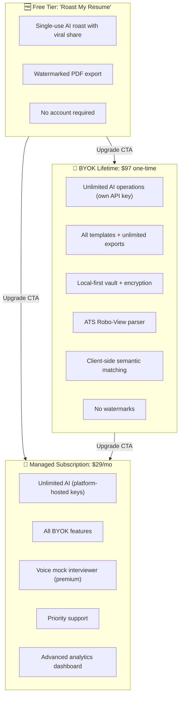

# Product Tiers & Packaging Strategy

## Goal

Define a **three-tier product structure** that balances acquisition (free viral tier), power user conversion (BYOK lifetime), and scalable recurring revenue (managed subscription). This plan captures the exact feature gates and the code touchpoints required to implement them.

## Source References

- **Monetization Strategy**: `cv-app-ng-frontend/AI Resume Builder Monetization Strategy.md` § "Tiered Monetization Model"
- **Implementation Basis**: `cv-app-ng-frontend/docs/implementation-plan/07-commercialization-licensing.md`
- **Related Plans**:
  - `11_licensing_and_gating_lemonsqueezy.plan.md` (implements activation/validation)
  - `12_roast_my_resume_viral_loop.plan.md` (implements the free tier feature)

## Three-Tier Product Architecture



## Feature-to-Tier Matrix

| Feature | Free | BYOK Lifetime | Managed Subscription |
|---------|------|---------------|----------------------|
| **CV Builder Wizard** | ✅ | ✅ | ✅ |
| **AI Roast (1x per session)** | ✅ | ✅ | ✅ |
| **Viral share image (watermarked)** | ✅ | ❌ (no watermark) | ❌ (no watermark) |
| **AI Extract/Tailor/Evaluate** | ❌ | ✅ (user API key) | ✅ (platform key) |
| **Template Recommendation** | ❌ | ✅ | ✅ |
| **Rephrase Bullets (AI)** | ❌ | ✅ (user key) | ✅ (platform key) |
| **PDF Export** | ✅ (watermarked) | ✅ (unlimited, clean) | ✅ (unlimited, clean) |
| **Template Library** | 1 template | All templates | All templates |
| **Local-First Vault (Dexie)** | ❌ | ✅ | ✅ |
| **ATS Robo-View Parser** | ❌ | ✅ | ✅ |
| **Client-Side Semantic Matching** | ❌ | ✅ | ✅ |
| **Chrome Extension Job Scraper** | ❌ | ✅ | ✅ |
| **Voice Mock Interviewer** | ❌ | ❌ | ✅ (managed-only) |
| **Analytics Dashboard** | ❌ | Basic | Advanced |
| **Support** | Community | Email | Priority |

## Pricing Strategy

### Free Tier: "Roast My Resume"
- **Price**: $0
- **Target**: Viral acquisition; job seekers looking for quick feedback
- **Conversion Strategy**: Watermark + upgrade CTA after roast → drives BYOK/Managed sign-ups
- **Limitations**:
  - Single-use roast per browser session (no persistence)
  - Watermarked PDF export
  - No access to vault, matching, or advanced features

### BYOK Lifetime: "Power User Edition"
- **Price**: **$97 one-time** (lifetime access)
- **Target**: Privacy-conscious professionals, developers, power users
- **Value Prop**: "Own your data, own your AI. Pay once, use forever."
- **Limitations**:
  - User must provide their own OpenAI/Anthropic API key
  - Voice interviewer not included (managed-only feature)
- **Conversion Strategy**: Position as "best value" and highlight privacy + no recurring fees

### Managed Subscription: "Hassle-Free Pro"
- **Price**: **$29/month** (or $249/year = ~$21/mo)
- **Target**: Non-technical users, active job seekers, enterprise users
- **Value Prop**: "Zero setup. Unlimited AI. Premium features."
- **Includes**: Platform-managed AI credits (no API key needed) + voice interviewer + priority support
- **Conversion Strategy**: Free trial (7 days) → highlight convenience over BYOK

## Gating Strategy (Implementation Touchpoints)

### Frontend Gating Logic

#### 1. Create Tier Types (`src/types.ts`)

```typescript
export enum UserTier {
  FREE = 'free',
  BYOK = 'byok_lifetime',
  MANAGED = 'managed_subscription'
}

export interface TierFeatures {
  canUseAIOperations: boolean;
  canUseMockInterviewer: boolean;
  canUseVault: boolean;
  canUseMatching: boolean;
  canUseATSView: boolean;
  canExportClean: boolean;
  maxTemplates: number | 'all';
  watermarkPDF: boolean;
}

export const TIER_FEATURE_MAP: Record<UserTier, TierFeatures> = {
  [UserTier.FREE]: {
    canUseAIOperations: false,
    canUseMockInterviewer: false,
    canUseVault: false,
    canUseMatching: false,
    canUseATSView: false,
    canExportClean: false,
    maxTemplates: 1,
    watermarkPDF: true
  },
  [UserTier.BYOK]: {
    canUseAIOperations: true, // with user API key
    canUseMockInterviewer: false,
    canUseVault: true,
    canUseMatching: true,
    canUseATSView: true,
    canExportClean: true,
    maxTemplates: 'all',
    watermarkPDF: false
  },
  [UserTier.MANAGED]: {
    canUseAIOperations: true,
    canUseMockInterviewer: true,
    canUseVault: true,
    canUseMatching: true,
    canUseATSView: true,
    canExportClean: true,
    maxTemplates: 'all',
    watermarkPDF: false
  }
};
```

#### 2. Tier Context (`src/contexts/TierContext.tsx`)

```typescript
interface TierContextValue {
  tier: UserTier;
  features: TierFeatures;
  hasFeature: (feature: keyof TierFeatures) => boolean;
  showUpgradeModal: (feature: string) => void;
}

export const TierProvider: React.FC<{ children: React.ReactNode }> = ({ children }) => {
  // Reads license status from LicenseContext (see plan 11_licensing)
  const { licenseStatus } = useLicense();
  const [tier, setTier] = useState<UserTier>(UserTier.FREE);
  
  useEffect(() => {
    if (licenseStatus?.type === 'byok') setTier(UserTier.BYOK);
    else if (licenseStatus?.type === 'managed') setTier(UserTier.MANAGED);
    else setTier(UserTier.FREE);
  }, [licenseStatus]);
  
  const features = TIER_FEATURE_MAP[tier];
  
  const hasFeature = (feature: keyof TierFeatures) => {
    return Boolean(features[feature]);
  };
  
  const showUpgradeModal = (feature: string) => {
    // Open modal with upgrade CTA
  };
  
  return (
    <TierContext.Provider value={{ tier, features, hasFeature, showUpgradeModal }}>
      {children}
    </TierContext.Provider>
  );
};
```

#### 3. UI Gating Points

**Files to Update:**

- **`src/components/CVStepperWizard.tsx`**
  - Before calling AI operations (extract/tailor/evaluate), check `hasFeature('canUseAIOperations')`
  - Show upgrade modal if not allowed

- **`src/components/RephraseButton.tsx`**
  - Disable if `!hasFeature('canUseAIOperations')`
  - Show tooltip: "Upgrade to BYOK or Managed to use AI rephrase"

- **`src/pages/DashboardPage.tsx`**
  - If `tier === FREE`, show "Upgrade to unlock vault" banner

- **`src/components/DownloadStep.tsx`**
  - If `features.watermarkPDF === true`, add watermark overlay to PDF preview
  - Show "Remove watermark" upgrade CTA

- **`src/pages/InterviewPage.tsx`** (future)
  - Block access if `!hasFeature('canUseMockInterviewer')`
  - Show: "Voice interviewer is exclusive to Managed Subscription"

### Backend Gating Logic (AI Service)

#### 1. Add Tier Validation Middleware

**File**: `cv-app-ng-ai-service/app/utils/tier_validation.py`

```python
from enum import Enum
from fastapi import HTTPException, Header
from typing import Optional

class UserTier(str, Enum):
    FREE = "free"
    BYOK = "byok_lifetime"
    MANAGED = "managed_subscription"

TIER_LIMITS = {
    UserTier.FREE: {
        "can_use_ai_operations": False,
        "can_use_mock_interviewer": False
    },
    UserTier.BYOK: {
        "can_use_ai_operations": True,
        "can_use_mock_interviewer": False
    },
    UserTier.MANAGED: {
        "can_use_ai_operations": True,
        "can_use_mock_interviewer": True
    }
}

def validate_tier_for_operation(
    operation: str,
    x_user_tier: Optional[str] = Header(None)
) -> UserTier:
    """
    Validates that the user's tier allows the requested operation.
    Raises HTTPException if not allowed.
    """
    tier = UserTier(x_user_tier) if x_user_tier else UserTier.FREE
    
    if operation == "ai_operations" and not TIER_LIMITS[tier]["can_use_ai_operations"]:
        raise HTTPException(
            status_code=403,
            detail="AI operations require BYOK Lifetime or Managed Subscription"
        )
    
    if operation == "mock_interviewer" and not TIER_LIMITS[tier]["can_use_mock_interviewer"]:
        raise HTTPException(
            status_code=403,
            detail="Voice interviewer is exclusive to Managed Subscription"
        )
    
    return tier
```

#### 2. Apply Middleware to Routes

**Files**: `cv-app-ng-ai-service/app/routes/jobs_routes.py`, `cv-app-ng-ai-service/app/routes/evaluation_routes.py`

```python
from app.utils.tier_validation import validate_tier_for_operation

@router.post("/jobs/extract")
async def create_extract_job(
    request: ExtractRequest,
    x_user_tier: Optional[str] = Header(None)
):
    validate_tier_for_operation("ai_operations", x_user_tier)
    # ... existing logic
```

**Note**: Frontend must send `X-User-Tier` header (derived from license status) with every AI API call.

## LemonSqueezy Product Setup

### Create Products in LemonSqueezy Dashboard

1. **BYOK Lifetime**
   - Type: Single payment
   - Price: $97 USD
   - License: Required (1 activation per purchase)
   - Metadata: `{"tier": "byok_lifetime"}`

2. **Managed Subscription**
   - Type: Subscription
   - Price: $29/month (or $249/year)
   - License: Required (active while subscription is active)
   - Metadata: `{"tier": "managed_subscription"}`

3. **Roast My Resume (Free)**
   - No LemonSqueezy product (handled in-app only)

### License Key → Tier Mapping

When the frontend activates a license via `11_licensing_and_gating_lemonsqueezy.plan.md`, the validation response includes product metadata. The frontend extracts `tier` from metadata and stores it locally:

```typescript
const activationResponse = await lemonsqueezy.activateLicense(key, instanceId);
const tier = activationResponse.meta.tier; // "byok_lifetime" or "managed_subscription"
// Store in encrypted vault
```

## Upgrade Flow UX

### Free → BYOK/Managed

**Trigger Points:**
- User clicks "Extract" / "Tailor" / "Evaluate" → blocked → show upgrade modal
- User clicks "Download PDF" → show "Remove watermark" CTA in preview
- Dashboard banner: "Unlock unlimited AI and vault storage"

**Modal Content:**

```
┌────────────────────────────────────────────────────────┐
│  Unlock This Feature                                   │
│                                                        │
│  [Icon] AI-Powered CV Operations                      │
│                                                        │
│  Choose your plan:                                     │
│                                                        │
│  ┌─────────────────┐  ┌─────────────────┐           │
│  │ BYOK Lifetime   │  │ Managed Pro     │           │
│  │ $97 one-time    │  │ $29/month       │           │
│  │                 │  │                 │           │
│  │ • Own your data │  │ • Zero setup    │           │
│  │ • Privacy-first │  │ • Unlimited AI  │           │
│  │ • Pay once      │  │ • Voice coach   │           │
│  │                 │  │                 │           │
│  │ [Select]        │  │ [Select]        │           │
│  └─────────────────┘  └─────────────────┘           │
│                                                        │
│  [Maybe Later]                                         │
└────────────────────────────────────────────────────────┘
```

### BYOK → Managed

**Trigger Point:**
- User clicks "Voice Mock Interviewer" → blocked → show upgrade modal
- Settings page: "Upgrade to Managed for hassle-free AI credits"

**Modal Content:**

```
Voice interviewer is exclusive to Managed Subscription.

Upgrade to Managed Pro to unlock:
• Voice mock interviewer with real-time feedback
• Platform-managed AI credits (no API key needed)
• Priority support

[Upgrade to Managed Pro - $29/mo]
[Keep BYOK Lifetime]
```

## Non-Goals (This Plan)

- ❌ Implementing the actual license activation/validation (see `11_licensing_and_gating_lemonsqueezy.plan.md`)
- ❌ Implementing the "Roast My Resume" feature (see `12_roast_my_resume_viral_loop.plan.md`)
- ❌ Implementing voice interviewer (see `22_voice_mock_interviewer.plan.md`)
- ❌ Building the pricing/checkout page (separate marketing/landing page work)

## Acceptance Criteria

- ✅ Feature-to-tier matrix documented and agreed upon
- ✅ `UserTier` enum and `TierFeatures` interface added to `cv-app-ng-frontend/src/types.ts`
- ✅ `TierContext` created and wired into `App.tsx`
- ✅ All premium features show upgrade modals when accessed by free users
- ✅ AI service routes validate `X-User-Tier` header and return `403` for unauthorized operations
- ✅ LemonSqueezy products created with correct metadata

## Open Questions

1. **Free tier roast limits**: Should we allow 1 roast per day or 1 per session? (Suggestion: 1 per browser session to maximize viral shares without requiring account)
2. **BYOK API key validation**: Should we validate the user's API key before allowing operations, or trust that they provided a valid key? (Suggestion: client-side validation before sending to backend)
3. **Managed subscription limits**: Do we cap AI operations per month (e.g., 500 requests)? (Suggestion: unlimited for MVP; add soft limits later if costs spike)

## Implementation Checklist

- [ ] **`define-tier-sku-specs`**: Finalize pricing, feature sets, and LemonSqueezy SKU setup
- [ ] **`create-feature-gating-matrix`**: Complete the matrix above and get stakeholder approval
- [ ] **`add-tier-types-frontend`**: Add TypeScript types to `src/types.ts`
- [ ] **`add-tier-context-frontend`**: Create `TierContext` and wire into `App.tsx`
- [ ] **`wire-tier-gates-ui`**: Update UI components to show upgrade modals for gated features
- [ ] **`add-tier-validation-backend`**: Add middleware to AI service routes

## Related Plans

- **`11_licensing_and_gating_lemonsqueezy.plan.md`**: Implements license activation, caching, and validation
- **`12_roast_my_resume_viral_loop.plan.md`**: Implements the free-tier viral feature
- **`22_voice_mock_interviewer.plan.md`**: Implements the managed-only voice coach feature
- **`local-first_vault_c7381a99.plan.md`**: Implements the BYOK/Managed vault feature

