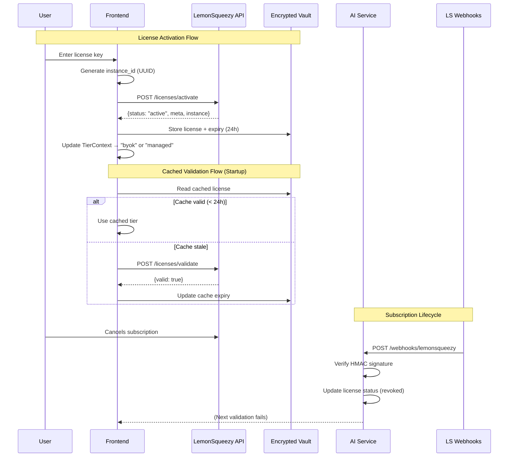

# LemonSqueezy Licensing & Feature Gating

## Goal

Implement a **secure, performant license validation system** using **LemonSqueezy** as the Merchant of Record (MoR). This system will:
- Activate and validate licenses for BYOK Lifetime ($97) and Managed Subscription ($29/mo)
- Cache validation results securely to minimize API calls and support offline usage
- Handle subscription lifecycle events (cancellation, refunds) via webhooks
- Provide a `LicenseContext` that powers the feature gating system defined in `10_product_tiers_and_packaging.plan.md`

## Source References

- **Monetization Strategy**: `cv-app-ng-frontend/AI Resume Builder Monetization Strategy.md` § "Licensing Infrastructure"
- **Implementation Basis**: `cv-app-ng-frontend/docs/implementation-plan/07-commercialization-licensing.md`
- **Related Plans**:
  - `10_product_tiers_and_packaging.plan.md` (defines tiers and feature gates)
  - `local-first_vault_c7381a99.plan.md` (provides encrypted storage for license cache)

## Architecture Overview



## LemonSqueezy Setup

### 1. Create Products & Variants

**LemonSqueezy Dashboard**: https://app.lemonsqueezy.com/products

#### Product 1: BYOK Lifetime
- **Name**: "ResuMint BYOK Lifetime"
- **Type**: Single payment
- **Price**: $97 USD
- **License Keys**: ✅ Enabled
  - Activations limit: 1
  - Expiry: Never
- **Metadata** (JSON):
  ```json
  {
    "tier": "byok_lifetime",
    "features": ["ai_operations", "vault", "matching", "ats_view", "all_templates"]
  }
  ```

#### Product 2: Managed Subscription
- **Name**: "ResuMint Managed Pro"
- **Type**: Subscription
- **Price**: $29/month (or $249/year variant)
- **License Keys**: ✅ Enabled
  - Activations limit: 3 (allow multi-device)
  - Expiry: When subscription ends
- **Metadata** (JSON):
  ```json
  {
    "tier": "managed_subscription",
    "features": ["ai_operations", "vault", "matching", "ats_view", "mock_interviewer", "all_templates"]
  }
  ```

### 2. Enable Webhooks

**LemonSqueezy Dashboard → Settings → Webhooks**

- **URL**: `https://api.resumint.dev/ai/webhooks/lemonsqueezy` (AI service endpoint)
- **Events**: Select all subscription events
  - `subscription_created`
  - `subscription_updated`
  - `subscription_cancelled`
  - `subscription_resumed`
  - `subscription_expired`
  - `order_refunded`
- **Secret**: Generate signing secret (store in `LEMONSQUEEZY_WEBHOOK_SECRET` env var)

## Frontend Implementation (`cv-app-ng-frontend`)

### 1. Add LemonSqueezy SDK

**File**: `package.json`

```json
{
  "dependencies": {
    "@lemonsqueezy/lemonsqueezy.js": "^3.0.0"
  }
}
```

### 2. Create LemonSqueezy Service Wrapper

**File**: `src/services/licenseService.ts`

```typescript
import { lemonSqueezySetup, activateLicense, validateLicense } from '@lemonsqueezy/lemonsqueezy.js';

lemonSqueezySetup({
  apiKey: import.meta.env.VITE_LEMONSQUEEZY_API_KEY, // Public key for client-side operations
});

export interface LicenseActivationResult {
  valid: boolean;
  tier: 'byok_lifetime' | 'managed_subscription';
  instanceId: string;
  expiresAt?: string;
  activationsUsed: number;
  activationsLimit: number;
}

export interface LicenseCacheEntry extends LicenseActivationResult {
  cachedAt: number;
  nextCheck: number; // Timestamp for next validation
}

export class LicenseService {
  
  /**
   * Activate a license key and bind it to this device.
   */
  async activateLicense(licenseKey: string, instanceId: string): Promise<LicenseActivationResult> {
    try {
      const response = await activateLicense(licenseKey, instanceId);
      
      if (!response.valid) {
        throw new Error(response.error || 'License activation failed');
      }
      
      return {
        valid: true,
        tier: response.meta.tier,
        instanceId,
        expiresAt: response.license_key.expires_at,
        activationsUsed: response.license_key.activation_usage,
        activationsLimit: response.license_key.activation_limit
      };
    } catch (error) {
      console.error('License activation error:', error);
      throw new Error('Failed to activate license. Please check your key and try again.');
    }
  }
  
  /**
   * Validate an already-activated license.
   */
  async validateLicense(licenseKey: string, instanceId: string): Promise<LicenseActivationResult> {
    try {
      const response = await validateLicense(licenseKey, instanceId);
      
      if (!response.valid) {
        return {
          valid: false,
          tier: 'byok_lifetime', // Default, but invalid
          instanceId,
          activationsUsed: 0,
          activationsLimit: 0
        };
      }
      
      return {
        valid: true,
        tier: response.meta.tier,
        instanceId,
        expiresAt: response.license_key.expires_at,
        activationsUsed: response.license_key.activation_usage,
        activationsLimit: response.license_key.activation_limit
      };
    } catch (error) {
      console.error('License validation error:', error);
      // Fail-open for network errors (use cached status)
      throw error;
    }
  }
}

export const licenseService = new LicenseService();
```

### 3. Add Instance ID Management

**File**: `src/services/deviceId.ts`

```typescript
import { v4 as uuidv4 } from 'uuid';

const INSTANCE_ID_KEY = 'resumint_instance_id_v1';

/**
 * Get or create a persistent device-specific instance ID.
 * This ID is used to bind licenses to a specific device.
 */
export function getOrCreateInstanceId(): string {
  let instanceId = localStorage.getItem(INSTANCE_ID_KEY);
  
  if (!instanceId) {
    instanceId = uuidv4();
    localStorage.setItem(INSTANCE_ID_KEY, instanceId);
  }
  
  return instanceId;
}
```

### 4. Implement License Cache in Vault

**File**: `src/storage/licenseStore.ts`

```typescript
import { db } from '../db/ResuMintDB'; // Dexie instance from vault plan
import { LicenseCacheEntry } from '../services/licenseService';

const CACHE_TTL_MS = 24 * 60 * 60 * 1000; // 24 hours

export class LicenseStore {
  
  /**
   * Store validated license in encrypted vault.
   */
  async cacheLicense(license: LicenseCacheEntry): Promise<void> {
    await db.licenses.put({
      id: 1, // Single-row table (only one active license per device)
      ...license,
      cachedAt: Date.now(),
      nextCheck: Date.now() + CACHE_TTL_MS
    });
  }
  
  /**
   * Retrieve cached license if it exists and is not expired.
   */
  async getCachedLicense(): Promise<LicenseCacheEntry | null> {
    const cached = await db.licenses.get(1);
    
    if (!cached) return null;
    
    // Return cached license even if stale (caller decides when to revalidate)
    return cached;
  }
  
  /**
   * Check if cached license needs revalidation.
   */
  async needsRevalidation(): Promise<boolean> {
    const cached = await this.getCachedLicense();
    if (!cached) return true;
    return Date.now() >= cached.nextCheck;
  }
  
  /**
   * Clear cached license (e.g., on logout or license revocation).
   */
  async clearLicense(): Promise<void> {
    await db.licenses.delete(1);
  }
}

export const licenseStore = new LicenseStore();
```

**Note**: Requires adding `licenses` table to Dexie schema in `src/db/ResuMintDB.ts`:

```typescript
db.version(2).stores({
  resumes: '++id, title, updatedAt',
  jobs: '++id, status',
  licenses: 'id' // Single-row table
});
```

### 5. Create License Context

**File**: `src/contexts/LicenseContext.tsx`

```typescript
import React, { createContext, useContext, useEffect, useState } from 'react';
import { licenseService, LicenseActivationResult } from '../services/licenseService';
import { licenseStore } from '../storage/licenseStore';
import { getOrCreateInstanceId } from '../services/deviceId';

interface LicenseContextValue {
  licenseStatus: LicenseActivationResult | null;
  isLoading: boolean;
  activateLicense: (key: string) => Promise<void>;
  revalidateLicense: () => Promise<void>;
  deactivateLicense: () => Promise<void>;
}

const LicenseContext = createContext<LicenseContextValue | undefined>(undefined);

export const LicenseProvider: React.FC<{ children: React.ReactNode }> = ({ children }) => {
  const [licenseStatus, setLicenseStatus] = useState<LicenseActivationResult | null>(null);
  const [isLoading, setIsLoading] = useState(true);
  
  // Load cached license on mount
  useEffect(() => {
    loadCachedLicense();
  }, []);
  
  const loadCachedLicense = async () => {
    try {
      const cached = await licenseStore.getCachedLicense();
      
      if (cached && cached.valid) {
        setLicenseStatus(cached);
        
        // Background revalidation if cache is stale
        if (await licenseStore.needsRevalidation()) {
          revalidateLicenseInBackground(cached.instanceId, cached.tier);
        }
      }
    } catch (error) {
      console.error('Failed to load cached license:', error);
    } finally {
      setIsLoading(false);
    }
  };
  
  const revalidateLicenseInBackground = async (instanceId: string, tier: string) => {
    try {
      // In a real implementation, you'd store the license key securely
      // For now, we assume validation happens via backend or stored key
      const validated = await licenseService.validateLicense('stored-key', instanceId);
      
      if (validated.valid) {
        await licenseStore.cacheLicense({
          ...validated,
          cachedAt: Date.now(),
          nextCheck: Date.now() + 24 * 60 * 60 * 1000
        });
        setLicenseStatus(validated);
      } else {
        // License is no longer valid (e.g., subscription cancelled)
        await licenseStore.clearLicense();
        setLicenseStatus(null);
      }
    } catch (error) {
      // Fail-open: keep using cached status if validation fails due to network
      console.warn('Background license revalidation failed:', error);
    }
  };
  
  const activateLicense = async (key: string) => {
    setIsLoading(true);
    try {
      const instanceId = getOrCreateInstanceId();
      const result = await licenseService.activateLicense(key, instanceId);
      
      await licenseStore.cacheLicense({
        ...result,
        cachedAt: Date.now(),
        nextCheck: Date.now() + 24 * 60 * 60 * 1000
      });
      
      setLicenseStatus(result);
    } catch (error) {
      throw error; // Re-throw so UI can show error message
    } finally {
      setIsLoading(false);
    }
  };
  
  const revalidateLicense = async () => {
    const cached = await licenseStore.getCachedLicense();
    if (!cached) return;
    
    await revalidateLicenseInBackground(cached.instanceId, cached.tier);
  };
  
  const deactivateLicense = async () => {
    await licenseStore.clearLicense();
    setLicenseStatus(null);
  };
  
  return (
    <LicenseContext.Provider value={{
      licenseStatus,
      isLoading,
      activateLicense,
      revalidateLicense,
      deactivateLicense
    }}>
      {children}
    </LicenseContext.Provider>
  );
};

export const useLicense = () => {
  const context = useContext(LicenseContext);
  if (!context) {
    throw new Error('useLicense must be used within LicenseProvider');
  }
  return context;
};
```

### 6. Add License Activation UI

**File**: `src/pages/ActivateLicensePage.tsx`

```typescript
import React, { useState } from 'react';
import { Button, TextInput, Text, Stack, Alert } from '@mantine/core';
import { useLicense } from '../contexts/LicenseContext';
import { useNavigate } from 'react-router-dom';

export const ActivateLicensePage: React.FC = () => {
  const { activateLicense, licenseStatus } = useLicense();
  const [key, setKey] = useState('');
  const [error, setError] = useState<string | null>(null);
  const [loading, setLoading] = useState(false);
  const navigate = useNavigate();
  
  const handleActivate = async () => {
    setError(null);
    setLoading(true);
    
    try {
      await activateLicense(key);
      navigate('/dashboard'); // Redirect after successful activation
    } catch (err: any) {
      setError(err.message || 'Activation failed');
    } finally {
      setLoading(false);
    }
  };
  
  if (licenseStatus?.valid) {
    return (
      <Stack>
        <Alert color="green">
          License activated! Tier: {licenseStatus.tier}
        </Alert>
        <Button onClick={() => navigate('/dashboard')}>Go to Dashboard</Button>
      </Stack>
    );
  }
  
  return (
    <Stack>
      <Text size="xl" fw={700}>Activate Your License</Text>
      <TextInput
        label="License Key"
        placeholder="XXXX-XXXX-XXXX-XXXX"
        value={key}
        onChange={(e) => setKey(e.currentTarget.value)}
      />
      {error && <Alert color="red">{error}</Alert>}
      <Button onClick={handleActivate} loading={loading} disabled={!key.trim()}>
        Activate License
      </Button>
      <Text size="sm" c="dimmed">
        Purchase a license at <a href="https://resumint.lemonsqueezy.com">resumint.lemonsqueezy.com</a>
      </Text>
    </Stack>
  );
};
```

### 7. Wire License Context into App

**File**: `src/App.tsx`

```typescript
import { LicenseProvider } from './contexts/LicenseContext';
import { TierProvider } from './contexts/TierContext'; // From plan 10_product_tiers

function App() {
  return (
    <LicenseProvider>
      <TierProvider>
        {/* Existing app routes */}
      </TierProvider>
    </LicenseProvider>
  );
}
```

## Backend Implementation (`cv-app-ng-ai-service`)

### 1. Add Webhook Endpoint

**File**: `app/routes/webhooks_routes.py`

```python
from fastapi import APIRouter, Request, HTTPException, Header
from typing import Optional
import hmac
import hashlib

router = APIRouter(prefix="/webhooks", tags=["webhooks"])

@router.post("/lemonsqueezy")
async def lemonsqueezy_webhook(
    request: Request,
    x_signature: Optional[str] = Header(None)
):
    """
    Handle LemonSqueezy webhook events.
    Verifies HMAC signature and processes subscription lifecycle events.
    """
    from app.core.config import settings
    
    # Read raw body (needed for signature verification)
    body = await request.body()
    body_str = body.decode('utf-8')
    
    # Verify signature
    if not x_signature:
        raise HTTPException(status_code=401, detail="Missing X-Signature header")
    
    expected_signature = hmac.new(
        settings.LEMONSQUEEZY_WEBHOOK_SECRET.encode('utf-8'),
        body_str.encode('utf-8'),
        hashlib.sha256
    ).hexdigest()
    
    if not hmac.compare_digest(x_signature, expected_signature):
        raise HTTPException(status_code=401, detail="Invalid signature")
    
    # Parse event
    import json
    event_data = json.loads(body_str)
    
    event_name = event_data.get('meta', {}).get('event_name')
    
    # Handle subscription events
    if event_name == 'subscription_cancelled':
        await handle_subscription_cancelled(event_data)
    elif event_name == 'subscription_expired':
        await handle_subscription_expired(event_data)
    elif event_name == 'subscription_resumed':
        await handle_subscription_resumed(event_data)
    elif event_name == 'order_refunded':
        await handle_order_refunded(event_data)
    
    return {"status": "ok"}

async def handle_subscription_cancelled(event_data):
    """Mark license as revoked when subscription is cancelled."""
    license_key = event_data['data']['attributes']['license_key']
    # TODO: Store revoked licenses in DynamoDB or similar
    # Next time frontend validates, it will get 'valid: false'
    print(f"Subscription cancelled for license: {license_key}")

async def handle_subscription_expired(event_data):
    """Handle subscription expiry."""
    license_key = event_data['data']['attributes']['license_key']
    print(f"Subscription expired for license: {license_key}")

async def handle_subscription_resumed(event_data):
    """Re-enable license when subscription is resumed."""
    license_key = event_data['data']['attributes']['license_key']
    print(f"Subscription resumed for license: {license_key}")

async def handle_order_refunded(event_data):
    """Revoke license when order is refunded."""
    license_key = event_data['data']['attributes']['license_key']
    print(f"Order refunded for license: {license_key}")
```

### 2. Add Webhook Secret to Config

**File**: `app/core/config.py`

```python
class Settings(BaseSettings):
    # ... existing settings
    
    LEMONSQUEEZY_WEBHOOK_SECRET: str = Field(
        ...,
        description="LemonSqueezy webhook signing secret"
    )
```

**File**: `env.example`

```bash
LEMONSQUEEZY_WEBHOOK_SECRET=your_webhook_secret_here
```

### 3. Wire Webhook Routes into Main App

**File**: `app/main.py`

```python
from app.routes import webhooks_routes

app.include_router(webhooks_routes.router, prefix="/ai")
```

## Security Considerations

### 1. Instance Binding
- Each license activation is bound to a device-specific `instance_id` (UUID)
- LemonSqueezy enforces activation limits (1 for BYOK, 3 for Managed)
- Prevents license sharing across unlimited devices

### 2. Signature Verification
- All webhook requests are verified using HMAC SHA-256
- Prevents spoofed webhook attacks that could revoke licenses maliciously

### 3. Secure Caching
- License cache is stored in **encrypted Dexie vault** (AES-GCM)
- Cache TTL is 24 hours to balance performance and security
- Fail-open strategy for network errors (use cached status if validation fails)

### 4. API Key Protection
- Frontend uses **public** LemonSqueezy API key (safe to expose)
- Backend webhook secret is stored in environment variables (never exposed to frontend)

## Offline Behavior

### Scenario: User is offline for > 24 hours

**Current Behavior (Fail-Open)**:
- License cache expires after 24 hours
- Frontend attempts revalidation → network error
- **Keeps using cached license status** (grace period)

**Alternative (Fail-Closed)**:
- Revoke access after cache expiry if validation fails
- **Risk**: Breaks offline-first promise

**Recommendation**: Implement **grace period** (7 days) before forcing revalidation to balance security and UX.

## Non-Goals (This Plan)

- ❌ Implementing the tier-to-feature mapping (see `10_product_tiers_and_packaging.plan.md`)
- ❌ Building the checkout/pricing page (separate marketing site)
- ❌ Implementing multi-device sync for license status (each device validates independently)

## Acceptance Criteria

- ✅ LemonSqueezy products created with license keys enabled
- ✅ Frontend can activate and validate licenses
- ✅ License status is cached securely in encrypted vault
- ✅ Background revalidation works on app startup
- ✅ Webhook endpoint verifies signatures and handles subscription events
- ✅ `LicenseContext` exposes license status to the rest of the app
- ✅ `TierContext` (from plan 10) consumes `LicenseContext` to determine user tier

## Open Questions

1. **License key storage**: Should we store the raw license key in the vault for revalidation, or rely on LemonSqueezy's instance binding? (Suggestion: store encrypted key for revalidation)
2. **Multi-device transfers**: If a user hits the activation limit, should we provide a "deactivate device" UI? (Suggestion: yes, via LemonSqueezy API `/licenses/deactivate`)
3. **Offline grace period**: How long should we allow cached licenses to work offline? (Suggestion: 7 days)

## Implementation Checklist

- [ ] **`setup-lemonsqueezy-products`**: Create products in LemonSqueezy dashboard
- [ ] **`add-lemonsqueezy-sdk-frontend`**: Add SDK to `package.json` and create service wrapper
- [ ] **`implement-license-activation-ui`**: Build activation page and flow
- [ ] **`implement-license-caching`**: Add `licenses` table to Dexie schema and implement cache logic
- [ ] **`add-license-revalidation-logic`**: Add background revalidation on app startup
- [ ] **`create-license-context-frontend`**: Create context and wire into `App.tsx`
- [ ] **`add-webhook-endpoint-backend`**: Add webhook route with signature verification
- [ ] **`handle-subscription-events`**: Implement handlers for subscription lifecycle events
- [ ] **`add-instance-id-management`**: Implement device ID generation and persistence

## Related Plans

- **`10_product_tiers_and_packaging.plan.md`**: Defines the tiers and feature gates that this plan enables
- **`local-first_vault_c7381a99.plan.md`**: Provides the encrypted storage layer for license caching
- **`12_roast_my_resume_viral_loop.plan.md`**: Uses tier info to gate watermarked vs clean exports

