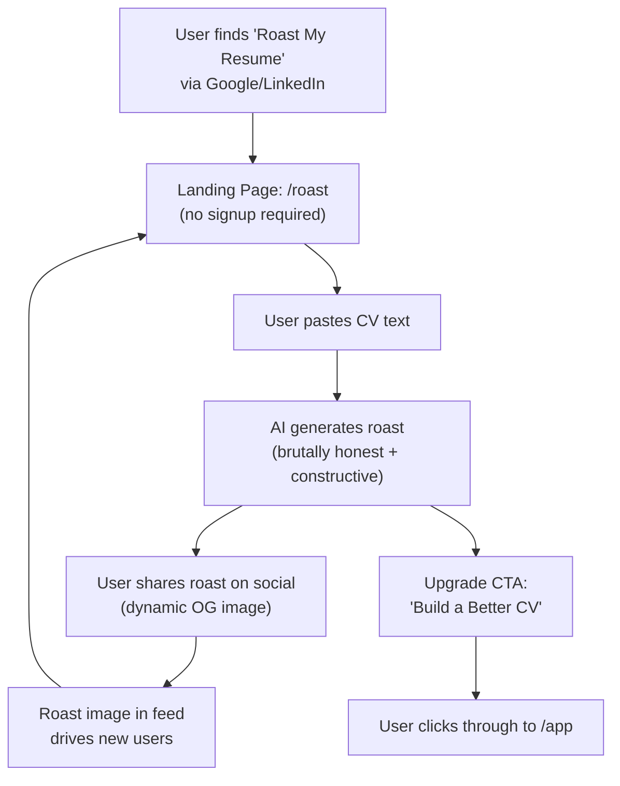

# Roast My Resume - Implementation Summary

## Status: ✅ COMPLETE

All checklist items from `12_roast_my_resume_viral_loop.plan.md` have been successfully implemented.

---

## What Was Built

### 1. AI Service (Backend) - `/cv-app-ng-ai-service`

#### Files Created:
- **`app/routes/roast_routes.py`**
  - POST `/ai/roast` endpoint
  - Rate limiting (5 min cooldown per content hash)
  - Input validation and sanitization
  - AI roast generation using Claude 3.5 Sonnet prompt
  - Score extraction (0-10)
  - Share URL generation with query params

#### Files Modified:
- **`app/main.py`**
  - Added roast router to FastAPI app with `/ai` prefix

#### Key Features:
- **Free tier**: No authentication required
- **Rate limiting**: MD5 hash-based cooldown (prevents spam)
- **Prompt engineering**: Brutally honest + constructive feedback
- **Error handling**: 429 for rate limits, 400 for validation, 500 for AI failures

---

### 2. PDF Generator Service (Backend) - `/cv-app-ng-pdf-generator`

#### Files Created:
- **`templates/roast_og_template.html`**
  - 1200x630 OG image template
  - Gradient background (orange/red fire theme)
  - Score badge + highlight text
  - Branded footer with CTA

- **`app/services/og_service.py`**
  - `OGService` class with Playwright-based image generation
  - HTML escaping (XSS prevention)
  - Screenshot capture (PNG format)

- **`app/routes/og_routes.py`**
  - GET `/pdf/og/roast` endpoint
  - Query params: `score` (0-10), `highlight` (text)
  - 7-day caching headers (`Cache-Control: public, max-age=604800`)

#### Files Modified:
- **`app/main.py`**
  - Added OG router with `/pdf` prefix

#### Key Features:
- **No external dependencies**: Uses existing Playwright infrastructure
- **Performance**: Caching headers reduce server load
- **Security**: HTML escaping prevents XSS in OG images

---

### 3. Frontend - `/cv-app-ng-frontend`

#### Files Created:
- **`src/pages/RoastPage.tsx`**
  - Landing page for Roast My Resume
  - CV text input (100-10,000 chars)
  - Loading states and error handling
  - Score badge with color coding (green/yellow/orange/red)
  - Share link copy functionality
  - Upgrade CTA (drives to `/app`)
  - Analytics tracking (consent-aware)

- **`src/pages/RoastSharePage.tsx`**
  - Share page with dynamic OG meta tags
  - Query params: `id`, `score`, `highlight`
  - Meta tag injection via `useEffect` (no react-helmet dependency)
  - Preview of roast result
  - CTAs: "Get Your Own Roast" + "Build a Professional CV"
  - Analytics tracking for share page views

#### Files Modified:
- **`src/services/api.ts`**
  - Added `roastCV()` method
  - Rate limit error handling (429 → user-friendly message)

- **`src/App.tsx`**
  - Added `/roast` route (RoastPage)
  - Added `/roast/share` route (RoastSharePage)
  - Both routes use `MarketingLayout` (public pages)

#### Key Features:
- **SEO-optimized**: `/roast` landing page for organic traffic
- **Viral mechanics**: Share URL with dynamic OG image
- **Privacy-first**: Analytics respect cookie consent
- **Conversion-focused**: Strategic upgrade CTAs after roast

---

## API Contracts

### AI Service Endpoint

**POST** `/ai/roast`

**Request:**
```json
{
  "cv_text": "string (100-10000 chars)"
}
```

**Response (200):**
```json
{
  "roast": "string (AI-generated roast text)",
  "score": 5,
  "share_url": "/roast/share?id=abc123&score=5&highlight=..."
}
```

**Error (429):**
```json
{
  "detail": "Slow down! You can only roast once every 5 minutes. Try again in 287 seconds."
}
```

---

### PDF Generator OG Image Endpoint

**GET** `/pdf/og/roast?score=5&highlight=Your+CV+is+full+of+buzzwords`

**Response:**
- Content-Type: `image/png`
- Dimensions: 1200x630
- Cache-Control: `public, max-age=604800, immutable`

---

## Analytics Events Tracked

All events respect cookie consent (`cookieService.canUseAnalytics()`):

| Event | Properties | Trigger |
|-------|------------|---------|
| `roast_generated` | `score`, `cv_length` | After successful roast generation |
| `roast_shared` | `score`, `method: 'copy_link'` | When user copies share link |
| `roast_upgrade_clicked` | `score`, `source: 'roast_results'` | When user clicks "Build a Better CV" from results |
| `roast_share_page_viewed` | `score`, `share_id` | When share page loads |
| `roast_share_cta_clicked` | `action`, `source_score` | When user clicks CTA on share page |

---

## Viral Loop Mechanics



---

## Security & Privacy

### Input Validation
- CV text length: 100-10,000 chars
- Uses `validate_cv_text()` from `app/utils/security.py`
- HTML escaping in OG images (prevents XSS)

### Rate Limiting
- Content-based MD5 hash (first 500 chars)
- 5-minute cooldown per hash
- In-memory cache (MVP; use Redis for production)

### PII Protection
- ✅ No CV text logged (only lengths/counts)
- ✅ No roast content stored (ephemeral)
- ✅ Share URLs use query params (no backend storage)

### Cookie Consent
- ✅ All analytics respect `cookieService.canUseAnalytics()`
- ✅ No tracking without user consent

---

## Testing Checklist

### Manual Testing Required:

- [ ] **Roast Generation**
  - [ ] Navigate to `/roast`
  - [ ] Paste CV text (100+ chars)
  - [ ] Click "Roast My Resume"
  - [ ] Verify roast appears with score (0-10)
  - [ ] Verify share link is generated

- [ ] **Rate Limiting**
  - [ ] Generate a roast
  - [ ] Try to roast the same CV again immediately
  - [ ] Verify 429 error with cooldown message

- [ ] **Share Functionality**
  - [ ] Click "Copy Share Link"
  - [ ] Verify link is copied to clipboard
  - [ ] Paste link in browser → verify `/roast/share` page loads

- [ ] **OG Image Generation**
  - [ ] Copy share URL
  - [ ] Paste in social media post (Twitter/LinkedIn)
  - [ ] Verify OG image appears with score + highlight
  - [ ] Verify image is 1200x630 and branded

- [ ] **Upgrade Flow**
  - [ ] After roast, click "Build a Better CV Now"
  - [ ] Verify redirect to `/app`

- [ ] **Analytics**
  - [ ] Open browser console
  - [ ] Accept analytics cookies
  - [ ] Generate a roast
  - [ ] Verify `roast_generated` event logged
  - [ ] Click share → verify `roast_shared` event logged

---

## Deployment Notes

### Environment Variables Required:

**AI Service:**
- `OPENAI_API_KEY` - System key for free tier roasts
- `CORS_ORIGINS` - Include frontend origin

**PDF Generator:**
- `CORS_ORIGINS` - Include frontend origin
- Playwright already installed (no new deps)

**Frontend:**
- `VITE_API_BASE_URL` - AI service URL
- `VITE_PDF_SERVICE_URL` - PDF generator URL
- `VITE_API_KEY` - API key for rate limiting

### No New Dependencies Added:
- ✅ Playwright already in PDF generator
- ✅ No Satori/Resvg needed (used Playwright instead)
- ✅ No react-helmet needed (native DOM manipulation)

---

## Production Optimizations (Future)

### Rate Limiting
- [ ] Migrate from in-memory dict to **Redis**
- [ ] Add IP-based rate limiting (currently content-hash only)
- [ ] Implement per-user rate limits after authentication

### OG Image Caching
- [ ] Cache rendered OG images in **S3 + CloudFront**
- [ ] Generate images asynchronously (reduce latency)
- [ ] Pre-render common score values (0-10)

### Analytics
- [ ] Integrate with **Plausible** or **Fathom** (privacy-focused)
- [ ] Track conversion funnel: roast → share → signup

### A/B Testing
- [ ] Test different roast personalities ("Savage" vs "Chill")
- [ ] Test upgrade CTA copy and placement
- [ ] Test share URL formatting (short links vs query params)

---

## Files Changed Summary

### cv-app-ng-ai-service (2 files)
- ✅ `app/routes/roast_routes.py` (created)
- ✅ `app/main.py` (modified)

### cv-app-ng-pdf-generator (5 files)
- ✅ `templates/roast_og_template.html` (created)
- ✅ `app/services/og_service.py` (created)
- ✅ `app/routes/og_routes.py` (created)
- ✅ `app/main.py` (modified)

### cv-app-ng-frontend (4 files)
- ✅ `src/pages/RoastPage.tsx` (created)
- ✅ `src/pages/RoastSharePage.tsx` (created)
- ✅ `src/services/api.ts` (modified)
- ✅ `src/App.tsx` (modified)

**Total: 11 files changed (7 created, 4 modified)**

---

## Next Steps

1. **Deploy** all three services to staging
2. **Test** the full flow end-to-end
3. **Monitor** rate limiting logs (adjust cooldown if needed)
4. **Share** the `/roast` landing page on social media
5. **Measure** conversion rate: roast → signup

---

## Related Plans

- ✅ **Plan 10**: `product_tiers_and_packaging.plan.md` (defines free tier)
- ✅ **Plan 11**: `licensing_and_gating_lemonsqueezy.plan.md` (upgrade flow)
- 🔜 **Plan 13**: `programmatic_seo_and_growth_pages.plan.md` (SEO for `/roast`)

---

**Implementation completed on:** December 24, 2025
**All todos marked as completed.**


