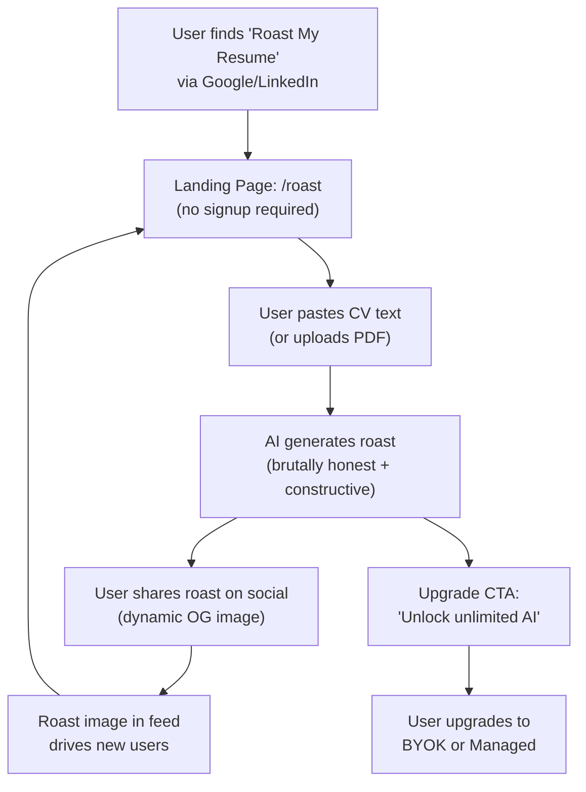

# Roast My Resume - Viral Growth Loop

## Goal

Build a **free, no-signup "Roast My Resume" feature** that:

1. Provides entertaining, viral-worthy AI feedback on CVs
2. Generates shareable Open Graph images for social media
3. Drives upgrades to BYOK/Managed tiers via strategic upgrade CTAs
4. Operates as a standalone landing page (`/roast`) optimized for SEO and social sharing

## Source References

- **Monetization Strategy**: `cv-app-ng-frontend/AI Resume Builder Monetization Strategy.md` § "Viral Acquisition Engine"
- **Implementation Basis**: `cv-app-ng-frontend/docs/implementation-plan/06-viral-growth-dynamic-media.md`
- **Related Plans**:
- `10_product_tiers_and_packaging.plan.md` (defines free tier limits)
- `11_licensing_and_gating_lemonsqueezy.plan.md` (powers upgrade flow)

## Viral Loop Mechanics



**Key Insight**: Each roast share is a **mini-billboard** for the product. The OG image must be:

- Visually striking (high contrast, bold typography)
- Instantly understandable (score + highlight)
- Branded (logo + "Roast My Resume by ResuMint")

## AI Roast Strategy

### Prompt Engineering for Viral Roasts

**Goal**: Generate feedback that is:

- **Brutally honest** (catches attention)
- **Constructive** (builds trust)
- **Entertaining** (drives shares)

**Prompt Template** (Anthropic Claude 3.5 Sonnet):

```javascript
You are a brutally honest career coach with a sharp sense of humor. 
A user has submitted their CV for a "roast" – your job is to provide 
honest, constructive feedback in an entertaining way.

Rules:
- Be witty but not cruel
- Point out 3-5 specific issues (typos, vague bullet points, poor formatting)
- Provide 1-2 actionable fixes
- End with a "roast score" out of 10 (lower = more issues)
- Keep it under 200 words

CV Text:
{cv_text}

Generate the roast:
```

**Example Output**:

```javascript
🔥 ROAST SCORE: 4/10

Let's be real: your CV reads like a LinkedIn profile written by ChatGPT. 
"Responsible for managing projects" tells me nothing. Were you managing 
a lemonade stand or a $5M budget?

THREE BIG ISSUES:
1. Generic buzzwords everywhere ("synergized", "leveraged", "spearheaded")
2. Zero quantifiable results (no numbers = no proof)
3. Typo in your job title ("Managre" is not a word)

THE FIX:
Replace vague verbs with numbers. "Managed 3 cross-functional teams 
(12 people) to deliver product launch 2 weeks ahead of schedule, 
generating $1.2M in Q1 revenue."

Also, spellcheck exists. Use it.
```


### Roast Personality Modes (Optional Enhancement)

Allow users to select roast style:

- **🔥 Savage**: Maximum brutality, viral-optimized
- **😎 Chill**: Constructive feedback with light humor
- **🤖 Robot**: ATS-focused, technical analysis

## Frontend Implementation (`cv-app-ng-frontend`)

### 1. Create Roast Landing Page

**File**: `src/pages/RoastPage.tsx`

```typescript
import React, { useState } from 'react';
import { Button, Textarea, Text, Stack, Card, Badge, Alert } from '@mantine/core';
import { IconFlame } from '@tabler/icons-react';
import { apiService } from '../services/api';

export const RoastPage: React.FC = () => {
  const [cvText, setCvText] = useState('');
  const [roast, setRoast] = useState<string | null>(null);
  const [score, setScore] = useState<number | null>(null);
  const [loading, setLoading] = useState(false);
  const [showUpgradeModal, setShowUpgradeModal] = useState(false);
  
  const handleRoast = async () => {
    if (!cvText.trim()) return;
    
    setLoading(true);
    try {
      const result = await apiService.roastCV(cvText);
      setRoast(result.roast);
      setScore(result.score);
      setShowUpgradeModal(true); // Show CTA after roast
    } catch (error) {
      console.error('Roast failed:', error);
    } finally {
      setLoading(false);
    }
  };
  
  const handleShare = () => {
    const shareUrl = `https://resumint.dev/roast/share?score=${score}`;
    navigator.clipboard.writeText(shareUrl);
    // Open share dialog
  };
  
  return (
    <Stack maw={800} mx="auto" p="xl">
      <Stack align="center" gap="xs">
        <IconFlame size={64} color="orange" />
        <Text size="xl" fw={700}>Roast My Resume</Text>
        <Text c="dimmed">Get brutally honest AI feedback on your CV (it's free)</Text>
      </Stack>
      
      {!roast ? (
        <>
          <Textarea
            label="Paste your CV text"
            placeholder="Copy and paste your resume here..."
            value={cvText}
            onChange={(e) => setCvText(e.currentTarget.value)}
            minRows={10}
            maxRows={20}
          />
          <Button
            onClick={handleRoast}
            loading={loading}
            size="lg"
            leftIcon={<IconFlame />}
            disabled={!cvText.trim()}
          >
            Roast My Resume
          </Button>
          <Text size="xs" c="dimmed" ta="center">
            No signup required. Your data is not stored.
          </Text>
        </>
      ) : (
        <>
          <Card shadow="sm" p="lg">
            <Badge size="xl" color="orange" mb="md">
              Roast Score: {score}/10
            </Badge>
            <Text style={{ whiteSpace: 'pre-wrap' }}>{roast}</Text>
          </Card>
          
          <Stack gap="sm">
            <Button onClick={handleShare} variant="light">
              Share My Roast
            </Button>
            <Button onClick={() => setShowUpgradeModal(true)} variant="gradient">
              Unlock Unlimited AI Features
            </Button>
            <Button onClick={() => { setRoast(null); setCvText(''); }} variant="subtle">
              Roast Another CV
            </Button>
          </Stack>
          
          <Alert color="yellow">
            Want to export a PDF? Upgrade to remove watermarks and unlock all templates.
          </Alert>
        </>
      )}
    </Stack>
  );
};
```


### 2. Add Roast API Method

**File**: `src/services/api.ts`

```typescript
export class ApiService {
  // ... existing methods
  
  async roastCV(cvText: string): Promise<{ roast: string; score: number }> {
    const response = await fetch(`${this.aiServiceUrl}/ai/roast`, {
      method: 'POST',
      headers: { 'Content-Type': 'application/json' },
      body: JSON.stringify({ cv_text: cvText })
    });
    
    if (!response.ok) {
      throw new Error('Roast generation failed');
    }
    
    return response.json();
  }
}
```


### 3. Add Roast Route

**File**: `src/App.tsx`

```typescript
import { RoastPage } from './pages/RoastPage';

<Route path="/roast" element={<RoastPage />} />
```


## AI Service Implementation (`cv-app-ng-ai-service`)

### 1. Add Roast Endpoint

**File**: `app/routes/roast_routes.py`

```python
from fastapi import APIRouter, HTTPException
from pydantic import BaseModel, Field
from app.services.ai_service import AIService
from app.utils.security import validate_cv_text
import hashlib
import time

router = APIRouter(prefix="/roast", tags=["roast"])

# In-memory rate limiter (simple MVP; use Redis for production)
roast_cache = {}

class RoastRequest(BaseModel):
    cv_text: str = Field(..., min_length=100, max_length=10000)

class RoastResponse(BaseModel):
    roast: str
    score: int
    share_url: str

@router.post("", response_model=RoastResponse)
async def roast_cv(request: RoastRequest):
    """
    Generate a brutally honest AI roast of a CV.
    Free tier endpoint (no auth required, rate-limited by IP).
    """
    # Validate input
    validated_text = validate_cv_text(request.cv_text)
    
    # Rate limiting (prevent abuse)
    ip_hash = hashlib.md5(validated_text[:200].encode()).hexdigest()
    
    if ip_hash in roast_cache:
        last_roast_time = roast_cache[ip_hash]
        if time.time() - last_roast_time < 300:  # 5 minutes cooldown
            raise HTTPException(
                status_code=429,
                detail="Slow down! You can only roast once every 5 minutes."
            )
    
    # Generate roast using AI service
    ai_service = AIService()
    
    prompt = f"""You are a brutally honest career coach with a sharp sense of humor. 
A user has submitted their CV for a "roast" – your job is to provide honest, 
constructive feedback in an entertaining way.

Rules:
- Be witty but not cruel
- Point out 3-5 specific issues (typos, vague bullet points, poor formatting)
- Provide 1-2 actionable fixes
- End with a "roast score" out of 10 (lower = more issues)
- Keep it under 200 words

CV Text:
{validated_text[:2000]}

Generate the roast:"""
    
    try:
        roast_text = await ai_service.generate_completion(
            prompt=prompt,
            max_tokens=300,
            temperature=0.8  # Higher creativity for entertaining roasts
        )
        
        # Extract score from roast (simple regex)
        import re
        score_match = re.search(r'(\d+)/10', roast_text)
        score = int(score_match.group(1)) if score_match else 5
        
        # Update rate limiter
        roast_cache[ip_hash] = time.time()
        
        # Generate share URL (for OG image)
        share_id = hashlib.md5(roast_text.encode()).hexdigest()[:8]
        share_url = f"https://resumint.dev/roast/share/{share_id}"
        
        return RoastResponse(
            roast=roast_text,
            score=score,
            share_url=share_url
        )
    
    except Exception as e:
        raise HTTPException(status_code=500, detail="Roast generation failed")
```


### 2. Wire Roast Routes into Main App

**File**: `app/main.py`

```python
from app.routes import roast_routes

app.include_router(roast_routes.router, prefix="/ai")
```


## Dynamic OG Image Generation (Satori + Resvg)

### Where Should This Live?

**Option A**: AI Service (Lambda)

- ❌ Lambda has 50MB deployment limit; Satori + fonts may exceed this
- ❌ Cold starts will be slow for image generation

**Option B**: PDF Generator Service (Fargate) ✅ Recommended

- ✅ Already has headless browser infrastructure (Playwright)
- ✅ Can reuse font assets and rendering pipeline
- ✅ Fargate has no size limits

**Decision**: Add OG image generation to `cv-app-ng-pdf-generator`

### Implementation in PDF Generator (`cv-app-ng-pdf-generator`)

#### 1. Add Satori + Resvg Dependencies

**File**: `requirements.txt`

```javascript
satori==0.1.0
resvg-py==0.1.0
```


#### 2. Create OG Image Template

**File**: `app/templates/roast_og_template.html`

```html
<div style="display: flex; flex-direction: column; width: 1200px; height: 630px; 
            background: linear-gradient(135deg, #FF6B6B 0%, #FF8E53 100%); 
            color: white; padding: 60px; font-family: 'Inter', sans-serif;">
  <div style="display: flex; align-items: center; gap: 20px; margin-bottom: 40px;">
    
    <div>
      <h1 style="font-size: 48px; font-weight: 800; margin: 0;">Roast My Resume</h1>
      <p style="font-size: 24px; opacity: 0.9; margin: 0;">by ResuMint</p>
    </div>
  </div>
  
  <div style="background: rgba(255,255,255,0.2); border-radius: 20px; padding: 40px; 
              backdrop-filter: blur(10px); flex: 1; display: flex; flex-direction: column;">
    <div style="font-size: 72px; font-weight: 900; margin-bottom: 20px;">
      🔥 Score: {{ score }}/10
    </div>
    <p style="font-size: 32px; line-height: 1.5; opacity: 0.95;">
      {{ highlight }}
    </p>
  </div>
  
  <p style="font-size: 20px; opacity: 0.8; margin-top: 30px; text-align: center;">
    Get your free roast at resumint.dev/roast
  </p>
</div>
```


#### 3. Add OG Image Route

**File**: `app/routes/og_routes.py`

```python
from fastapi import APIRouter, Query
from fastapi.responses import Response
from app.services.og_service import OGService

router = APIRouter(prefix="/og", tags=["og"])

@router.get("/roast")
async def generate_roast_og_image(
    score: int = Query(..., ge=0, le=10),
    highlight: str = Query(..., max_length=200)
):
    """
    Generate a dynamic Open Graph image for roast shares.
    Returns a PNG image optimized for social media.
    """
    og_service = OGService()
    
    image_bytes = await og_service.generate_roast_image(
        score=score,
        highlight=highlight
    )
    
    return Response(
        content=image_bytes,
        media_type="image/png",
        headers={
            "Cache-Control": "public, max-age=604800",  # Cache for 7 days
            "Content-Disposition": "inline; filename=roast-og.png"
        }
    )
```


#### 4. Create OG Image Service

**File**: `app/services/og_service.py`

```python
from satori import Satori
from resvg import Resvg
from pathlib import Path

class OGService:
    def __init__(self):
        self.satori = Satori()
        self.template_path = Path(__file__).parent.parent / "templates" / "roast_og_template.html"
    
    async def generate_roast_image(self, score: int, highlight: str) -> bytes:
        """
        Generate OG image for roast using Satori (HTML→SVG) + Resvg (SVG→PNG).
        """
        # Load template
        template = self.template_path.read_text()
        
        # Render with data
        html = template.replace("{{ score }}", str(score))
        html = html.replace("{{ highlight }}", highlight[:150] + "..." if len(highlight) > 150 else highlight)
        
        # Convert HTML → SVG
        svg = self.satori.render(html, width=1200, height=630)
        
        # Convert SVG → PNG
        png_bytes = Resvg().render(svg)
        
        return png_bytes
```


### Meta Tags for Roast Share Page

**File**: `src/pages/RoastSharePage.tsx` (new)

```typescript
import React, { useEffect } from 'react';
import { Helmet } from 'react-helmet';
import { useParams } from 'react-router-dom';

export const RoastSharePage: React.FC = () => {
  const { shareId } = useParams<{ shareId: string }>();
  
  // Fetch roast data from backend or cache
  const roastData = { score: 4, highlight: "Your CV is full of buzzwords..." };
  
  const ogImageUrl = `https://api.resumint.dev/pdf/og/roast?score=${roastData.score}&highlight=${encodeURIComponent(roastData.highlight)}`;
  
  return (
    <>
      <Helmet>
        <title>Roast My Resume - ResuMint</title>
        <meta property="og:title" content="I got my resume roasted by AI 🔥" />
        <meta property="og:description" content={`Roast Score: ${roastData.score}/10. ${roastData.highlight}`} />
        <meta property="og:image" content={ogImageUrl} />
        <meta property="og:image:width" content="1200" />
        <meta property="og:image:height" content="630" />
        <meta name="twitter:card" content="summary_large_image" />
      </Helmet>
      
      {/* Render roast content */}
    </>
  );
};
```


## Watermark Strategy (Free Tier PDFs)

### Add Watermark Overlay in PDF Generator

**File**: `app/services/pdf_service.py`

```python
async def add_watermark_to_pdf(pdf_bytes: bytes, tier: str) -> bytes:
    """
    Add watermark to PDF if user is on free tier.
    """
    if tier != "free":
        return pdf_bytes  # No watermark for paid tiers
    
    # Use PyPDF2 or similar to add watermark overlay
    # Watermark text: "Created with ResuMint | Upgrade at resumint.dev"
    # Position: Bottom-right corner, subtle gray
    
    # ... watermark logic
    
    return watermarked_pdf_bytes
```


## Analytics & Conversion Tracking

### Privacy-Respecting Analytics

**File**: `src/services/analyticsService.ts`

```typescript
import { cookieService } from './cookieService'; // From existing codebase

export class AnalyticsService {
  trackRoastGenerated(score: number) {
    if (!cookieService.hasConsent('analytics')) return;
    
    // Track with privacy-respecting analytics (e.g., Plausible, Fathom)
    window.plausible?.('Roast Generated', { props: { score } });
  }
  
  trackRoastShared() {
    if (!cookieService.hasConsent('analytics')) return;
    
    window.plausible?.('Roast Shared');
  }
  
  trackUpgradeClick(source: string) {
    if (!cookieService.hasConsent('analytics')) return;
    
    window.plausible?.('Upgrade Clicked', { props: { source } });
  }
}

export const analyticsService = new AnalyticsService();
```


## Non-Goals (This Plan)

- ❌ Building a full roast history/library (free tier is single-use)
- ❌ Implementing user accounts for free tier (no-signup required)
- ❌ A/B testing roast personalities (ship one mode first)

## Acceptance Criteria

- ✅ `/roast` landing page is live and SEO-optimized
- ✅ AI roast endpoint works (rate-limited, no auth)
- ✅ OG images are generated dynamically and cached
- ✅ Free-tier PDFs have watermarks
- ✅ Upgrade CTAs are shown after roast
- ✅ Share functionality works with proper OG meta tags
- ✅ Analytics track roast generation and upgrade clicks (with consent)

## Open Questions

1. **Roast personality**: Should we ship with one mode or multiple? (Suggestion: one "savage" mode for MVP)
2. **Rate limiting**: 5 minutes per IP sufficient, or do we need fingerprinting? (Suggestion: 5 min is fine for MVP)
3. **Roast storage**: Should we cache roasts for share pages, or generate on-demand? (Suggestion: cache for 7 days in Redis)

## Implementation Checklist

- [ ] **`design-roast-prompts`**: Finalize AI prompt and test with sample CVs
- [ ] **`add-roast-endpoint-ai-service`**: Implement `/ai/roast` with rate limiting
- [ ] **`create-roast-ui-frontend`**: Build landing page and flow
- [ ] **`implement-satori-og-images`**: Add Satori/Resvg to PDF generator
- [ ] **`add-og-image-endpoint`**: Create `/pdf/og/roast` route
- [ ] **`add-watermark-to-free-pdfs`**: Implement watermark overlay logic
- [ ] **`implement-upgrade-ctas-after-roast`**: Show upgrade modal with CTAs
- [ ] **`add-share-analytics`**: Track roast shares and upgrade conversions

## Related Plans

- **`10_product_tiers_and_packaging.plan.md`**: Defines free tier feature set
- **`11_licensing_and_gating_lemonsqueezy.plan.md`**: Powers upgrade flow