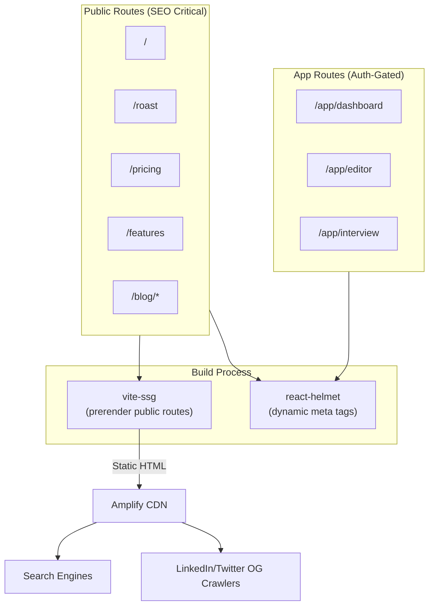

# Programmatic SEO & Growth Pages

## Goal

Drive **organic acquisition** through SEO-optimized content without forcing a premature migration from Vite SPA to Next.js or another SSR framework. This plan balances:
- **Pragmatism**: Maximize ROI with minimal infrastructure changes
- **Scalability**: Leave the door open for future SSR/SSG migration if traffic justifies it
- **Speed**: Ship content quickly to capture search traffic while competitors are sleeping

## Source References

- **Monetization Strategy**: `cv-app-ng-frontend/AI Resume Builder Monetization Strategy.md` § "Growth Strategy"
- **Related Plans**:
  - `12_roast_my_resume_viral_loop.plan.md` (provides viral acquisition surface)
  - `10_product_tiers_and_packaging.plan.md` (defines value props for landing pages)

## Current State Assessment

### What Vite SPA Already Provides
- ✅ **Fast page loads** (code splitting, lazy loading)
- ✅ **Client-side routing** (no full page reloads)
- ✅ **Modern build tooling** (Rollup, tree-shaking, minification)

### What Vite SPA Lacks for SEO
- ❌ **Server-Side Rendering (SSR)**: Search engines see a blank HTML shell
- ❌ **Static Site Generation (SSG)**: No pre-rendered HTML for fast indexing
- ❌ **Dynamic meta tags**: OG tags are not rendered for crawlers

### The SEO Dilemma

**Option A: Do Nothing**
- ❌ Poor SEO (Googlebot can execute JS, but ranking suffers)
- ❌ No social previews (LinkedIn/Twitter can't see OG images)

**Option B: Migrate to Next.js**
- ✅ Best SEO (SSR + SSG)
- ❌ Major rewrite (weeks of work, risky)
- ❌ Hosting complexity (need Node server or Vercel)

**Option C: Hybrid Approach (Recommended)** ✅
- ✅ Keep Vite SPA for app routes (`/app/*`)
- ✅ Add prerendering for marketing pages (`/`, `/roast`, `/pricing`)
- ✅ Use `react-helmet` for dynamic meta tags
- ✅ Ship content fast, defer SSR migration to Phase 5

## Architecture Decision: Vite SPA + Prerendering



## Implementation Strategy

### Phase 1: Foundation (Quick Wins)

#### 1. Add Dynamic Meta Tags with `react-helmet`

**Install**:
```bash
npm install react-helmet @types/react-helmet
```

**File**: `src/pages/HomePage.tsx`

```typescript
import React from 'react';
import { Helmet } from 'react-helmet';

export const HomePage: React.FC = () => {
  return (
    <>
      <Helmet>
        <title>ResuMint - AI-Powered Resume Builder | BYOK Lifetime $97</title>
        <meta name="description" content="Build perfect resumes with AI. Bring your own OpenAI key for lifetime access. No subscriptions. Privacy-first." />
        
        {/* Open Graph */}
        <meta property="og:title" content="ResuMint - AI-Powered Resume Builder" />
        <meta property="og:description" content="Build perfect resumes with AI. BYOK Lifetime $97. No subscriptions." />
        <meta property="og:image" content="https://resumint.dev/og-image.png" />
        <meta property="og:url" content="https://resumint.dev" />
        <meta property="og:type" content="website" />
        
        {/* Twitter */}
        <meta name="twitter:card" content="summary_large_image" />
        <meta name="twitter:title" content="ResuMint - AI-Powered Resume Builder" />
        <meta name="twitter:description" content="Build perfect resumes with AI. BYOK Lifetime $97." />
        <meta name="twitter:image" content="https://resumint.dev/og-image.png" />
        
        {/* Structured Data (JSON-LD) */}
        <script type="application/ld+json">
          {JSON.stringify({
            "@context": "https://schema.org",
            "@type": "SoftwareApplication",
            "name": "ResuMint",
            "description": "AI-powered resume builder with local-first privacy",
            "applicationCategory": "BusinessApplication",
            "offers": {
              "@type": "Offer",
              "price": "97",
              "priceCurrency": "USD"
            },
            "operatingSystem": "Web Browser"
          })}
        </script>
      </Helmet>
      
      {/* Page content */}
    </>
  );
};
```

#### 2. Add `robots.txt`

**File**: `public/robots.txt`

```
User-agent: *
Allow: /
Disallow: /app/

Sitemap: https://resumint.dev/sitemap.xml
```

#### 3. Generate Sitemap

**Option A: Static Sitemap** (MVP)

**File**: `public/sitemap.xml`

```xml
<?xml version="1.0" encoding="UTF-8"?>
<urlset xmlns="http://www.sitemaps.org/schemas/sitemap/0.9">
  <url>
    <loc>https://resumint.dev/</loc>
    <changefreq>weekly</changefreq>
    <priority>1.0</priority>
  </url>
  <url>
    <loc>https://resumint.dev/roast</loc>
    <changefreq>weekly</changefreq>
    <priority>0.9</priority>
  </url>
  <url>
    <loc>https://resumint.dev/pricing</loc>
    <changefreq>monthly</changefreq>
    <priority>0.8</priority>
  </url>
  <url>
    <loc>https://resumint.dev/features</loc>
    <changefreq>monthly</changefreq>
    <priority>0.8</priority>
  </url>
</urlset>
```

**Option B: Dynamic Sitemap** (Future)

Use a build script to generate sitemap from routes automatically.

### Phase 2: Prerendering (For Better Indexing)

#### Use `vite-plugin-ssr` or `vite-ssg`

**Install**:
```bash
npm install vite-ssg
```

**File**: `vite.config.ts`

```typescript
import { defineConfig } from 'vite';
import react from '@vitejs/plugin-react';
import { VitePWA } from 'vite-plugin-pwa';
import viteSSG from 'vite-ssg';

export default defineConfig({
  plugins: [
    react(),
    VitePWA(),
    viteSSG({
      // Routes to prerender
      includedRoutes: ['/', '/roast', '/pricing', '/features', '/about'],
      // Routes to skip (auth-gated)
      excludedRoutes: ['/app/*']
    })
  ]
});
```

**Build Output**:
```
dist/
  index.html           ← Prerendered
  roast.html           ← Prerendered
  pricing.html         ← Prerendered
  features.html        ← Prerendered
  app/                 ← Client-rendered (SPA)
```

**Result**: Marketing pages are **crawlable HTML** while app routes remain a dynamic SPA.

### Phase 3: Content Strategy

#### Landing Pages to Create

| Page | Route | Primary Keyword | CTA |
|------|-------|----------------|-----|
| **Home** | `/` | "AI resume builder", "BYOK resume tool" | Start for Free |
| **Roast My Resume** | `/roast` | "roast my resume", "AI resume feedback" | Get Roast → Upgrade |
| **Pricing** | `/pricing` | "resume builder pricing", "lifetime deal" | Buy BYOK |
| **Features** | `/features` | "AI CV features", "local-first resume" | Start for Free |
| **ATS Guide** | `/features/ats-view` | "ATS resume checker", "ATS optimization" | Try ATS View |
| **Voice Interviewer** | `/features/mock-interview` | "AI mock interview", "interview practice" | Upgrade to Managed |
| **About** | `/about` | "ResuMint privacy", "BYOK resume builder" | — |

#### Blog Content Strategy

**Option A: MDX in Repo** (Recommended for MVP)
- ✅ Simple, version-controlled, no external dependencies
- ✅ Can use `vite-plugin-mdx` to render MDX as React components
- ❌ No non-technical editing (requires Git commits)

**File Structure**:
```
src/
  content/
    blog/
      how-to-beat-ats.mdx
      byok-vs-managed-ai.mdx
      resume-mistakes-2025.mdx
```

**File**: `src/pages/BlogPage.tsx`

```typescript
import { useParams } from 'react-router-dom';
import { lazy, Suspense } from 'react';

const blogPosts = {
  'how-to-beat-ats': lazy(() => import('../content/blog/how-to-beat-ats.mdx')),
  'byok-vs-managed-ai': lazy(() => import('../content/blog/byok-vs-managed-ai.mdx')),
  // ...
};

export const BlogPage: React.FC = () => {
  const { slug } = useParams<{ slug: string }>();
  const BlogPost = blogPosts[slug];
  
  if (!BlogPost) return <div>Post not found</div>;
  
  return (
    <Suspense fallback={<div>Loading...</div>}>
      <BlogPost />
    </Suspense>
  );
};
```

**Option B: Headless CMS (Future)**
- ✅ Non-technical editing (marketing team can publish)
- ✅ Scheduled publishing, drafts, rich media
- ❌ Adds complexity (API calls, caching, build hooks)

**Candidates**: Contentful, Sanity, Strapi

#### Blog Topics (High-Intent Keywords)

1. **"How to Beat ATS Systems in 2025"** → `/blog/how-to-beat-ats`
2. **"BYOK vs Managed AI: Which Resume Builder is Right for You?"** → `/blog/byok-vs-managed-ai`
3. **"Top 10 Resume Mistakes That Cost You Interviews"** → `/blog/resume-mistakes-2025`
4. **"Voice Mock Interviews: AI That Feels Real"** → `/blog/voice-mock-interview-guide`
5. **"Why Your Resume Needs Local-First Privacy"** → `/blog/local-first-resume-security`

Each post should:
- Be 1,500–2,500 words
- Include internal links to features/pricing
- End with a CTA ("Try Roast My Resume" or "Upgrade to BYOK")

### Phase 4: Structured Data (Rich Snippets)

#### Add JSON-LD for Rich Results

**File**: `src/pages/PricingPage.tsx`

```typescript
<Helmet>
  <script type="application/ld+json">
    {JSON.stringify({
      "@context": "https://schema.org",
      "@type": "Product",
      "name": "ResuMint BYOK Lifetime",
      "description": "Lifetime access to AI resume builder with your own API key",
      "offers": {
        "@type": "Offer",
        "price": "97",
        "priceCurrency": "USD",
        "availability": "https://schema.org/InStock"
      },
      "aggregateRating": {
        "@type": "AggregateRating",
        "ratingValue": "4.8",
        "reviewCount": "127"
      }
    })}
  </script>
</Helmet>
```

**Result**: Google may show **star ratings** and **price** in search results.

#### FAQ Schema (for `/features/ats-view`)

```typescript
<script type="application/ld+json">
  {JSON.stringify({
    "@context": "https://schema.org",
    "@type": "FAQPage",
    "mainEntity": [
      {
        "@type": "Question",
        "name": "What is ATS?",
        "acceptedAnswer": {
          "@type": "Answer",
          "text": "ATS (Applicant Tracking System) is software used by 98% of Fortune 500 companies to filter resumes before a human sees them."
        }
      },
      {
        "@type": "Question",
        "name": "How does ResuMint's ATS View work?",
        "acceptedAnswer": {
          "@type": "Answer",
          "text": "Our ATS View parses your PDF resume exactly like an ATS robot would, showing you what the system 'sees' so you can optimize formatting and keywords."
        }
      }
    ]
  })}
</script>
```

## Performance & Core Web Vitals

### Ensure Fast Page Loads (SEO Ranking Factor)

**Metrics to Optimize**:
- **Largest Contentful Paint (LCP)**: < 2.5s
- **First Input Delay (FID)**: < 100ms
- **Cumulative Layout Shift (CLS)**: < 0.1

**Tactics**:
1. **Lazy load images**: Use `loading="lazy"` on all non-critical images
2. **Preload fonts**: `<link rel="preload" href="/fonts/Inter.woff2" as="font">`
3. **Code splitting**: Already handled by Vite (React.lazy)
4. **CDN**: Amplify already provides this

## Alternative: Separate Marketing Site (Deferred)

**If** traffic justifies it in Phase 5:
- Create a **separate Next.js site** for marketing pages (`marketing.resumint.dev` or subdirectory)
- Deploy to Vercel with SSG
- Keep main app as Vite SPA (`app.resumint.dev`)

**Pros**:
- ✅ Best SEO (full SSR/SSG)
- ✅ Marketing team can iterate independently

**Cons**:
- ❌ Split codebase (components must be duplicated or shared via package)
- ❌ More deployment complexity

**Decision**: Defer until organic traffic > 10k/month justifies the investment.

## Non-Goals (This Plan)

- ❌ Migrating entire app to Next.js (keep Vite SPA for `/app/*`)
- ❌ Building a full CMS (MDX in repo is sufficient for MVP)
- ❌ A/B testing landing pages (ship fast, iterate based on analytics)

## Acceptance Criteria

- ✅ All marketing pages have `react-helmet` meta tags (title, description, OG tags)
- ✅ `robots.txt` and `sitemap.xml` exist and are valid
- ✅ Vite SSG prerendering works for `/`, `/roast`, `/pricing`, `/features`
- ✅ At least 3 blog posts published (MDX in repo)
- ✅ Structured data (JSON-LD) added to pricing and features pages
- ✅ Core Web Vitals pass (LCP < 2.5s, FID < 100ms, CLS < 0.1)

## Open Questions

1. **Blog authoring**: Should we use MDX in repo or add a headless CMS? (Suggestion: MDX for MVP, CMS when marketing team grows)
2. **Link building strategy**: How do we acquire backlinks? (Suggestion: submit to Product Hunt, Hacker News, Reddit; guest post on career blogs)
3. **Local SEO**: Do we need location-specific pages (e.g., "Resume builder in NYC")? (Suggestion: no, too much effort for diminishing returns)

## Implementation Checklist

- [ ] **`seo-audit-current-state`**: Audit current Vite SPA SEO (test with Google Search Console)
- [ ] **`decide-seo-architecture`**: Decide on Vite + prerendering (approved)
- [ ] **`add-helmet-meta-tags`**: Add `react-helmet` to all public pages
- [ ] **`implement-sitemap-generation`**: Create `sitemap.xml` (static for MVP)
- [ ] **`add-robots-txt`**: Add `robots.txt` to allow/disallow routes
- [ ] **`create-marketing-landing-pages`**: Build home, pricing, features, roast, about pages
- [ ] **`implement-blog-content-strategy`**: Add MDX support and write 3 blog posts
- [ ] **`add-structured-data-markup`**: Add JSON-LD to pricing, features, FAQ pages

## Related Plans

- **`12_roast_my_resume_viral_loop.plan.md`**: Provides `/roast` as a viral acquisition surface
- **`10_product_tiers_and_packaging.plan.md`**: Defines value props for pricing/features pages
- **`20_ats_robo_view.plan.md`**: Feature to highlight in SEO content ("ATS View")

