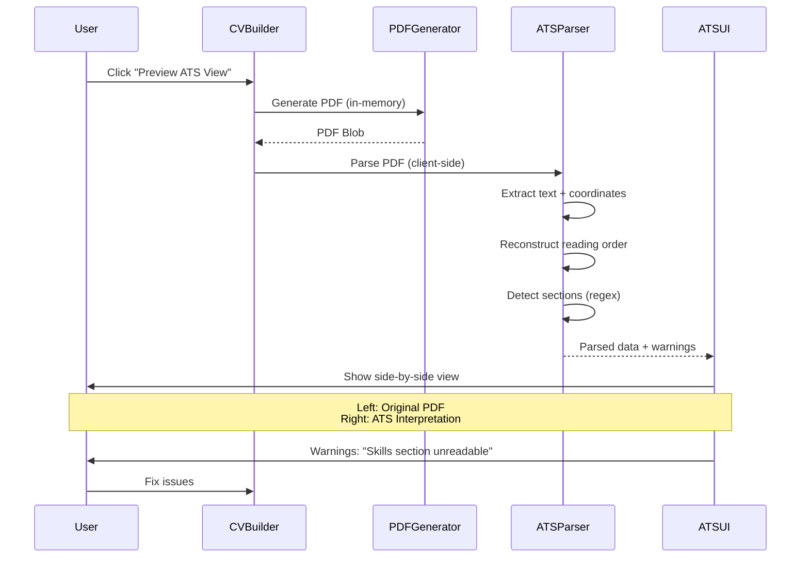

# ATS Robo-View: "See What the Robot Sees"

## Goal

Build a **client-side PDF parsing engine** that shows users **exactly what ATS (Applicant Tracking System) robots see** when they scan a resume. This feature:

- Helps users optimize their resume formatting for maximum ATS pass-through rates
- Differentiates ResuMint from competitors (most resume builders ignore ATS compliance)
- Provides immediate, actionable feedback ("Your skills section is unreadable to ATS")
- Reinforces the "privacy-first" brand (parsing happens locally, no server upload)

## Source References

- **Implementation Basis**: `cv-app-ng-frontend/docs/implementation-plan/03-resume-intelligence-parsing.md`
- **Related Plans**:
- `10_product_tiers_and_packaging.plan.md` (ATS View is a BYOK/Managed feature)
- `13_programmatic_seo_and_growth_pages.plan.md` (ATS View is a content marketing hook)

## The ATS Problem (Why This Matters)

**98% of Fortune 500 companies use ATS software** to filter resumes before a human sees them. These systems:

- Extract text from PDFs using coordinate-based parsing (not semantic understanding)
- Fail on complex layouts (multi-column, tables, text boxes)
- Miss skills hidden in graphics or unusual fonts
- Reject resumes with parsing errors (no second chances)

**Common ATS Failure Modes**:

1. **Multi-column layouts** → text order gets scrambled (left column, right column mixed)
2. **Tables** → cells parsed out of order, headers lost
3. **Graphics/logos in header** → ignored or cause parsing crashes
4. **Fancy fonts** → character encoding issues (é becomes "e")
5. **Skills in images** → invisible to ATS (e.g., skill badges, infographics)

**User Pain**: A beautifully designed resume can score **0% ATS pass rate** due to invisible formatting issues.

## Feature Spec

### User Flow




### UI Design (Side-by-Side Comparison)

```javascript
┌─────────────────────────────────────────────────────────────────┐
│  ATS Robo-View: See What the Robot Sees                         │
├─────────────────────────────────────────────────────────────────┤
│                                                                  │
│  ┌──────────────────────┐  ┌──────────────────────────────┐   │
│  │  Your Resume (PDF)   │  │  What ATS Sees              │   │
│  ├──────────────────────┤  ├──────────────────────────────┤   │
│  │                      │  │  JOHN DOE                    │   │
│  │  [Visual PDF]        │  │  johndoe@example.com         │   │
│  │                      │  │                              │   │
│  │  • Skills in badges  │  │  ⚠️ SECTION MISSING: Skills  │   │
│  │  • Two-column layout │  │  ⚠️ Text order scrambled     │   │
│  │                      │  │                              │   │
│  │                      │  │  EXPERIENCE                  │   │
│  │                      │  │  Software Engineer           │   │
│  │                      │  │  Built scalable systems...   │   │
│  └──────────────────────┘  └──────────────────────────────┘   │
│                                                                  │
│  ⚠️ ATS Compatibility Warnings:                                 │
│  • Skills section is unreadable (uses graphics)                 │
│  • Multi-column layout detected (may scramble text order)       │
│  • Recommendation: Use single-column layout + text-based skills │
│                                                                  │
│  [Download ATS-Friendly Template]  [Fix Issues Automatically]   │
└─────────────────────────────────────────────────────────────────┘
```


## Technical Architecture

### PDF.js Integration (Client-Side Parsing)

**Why PDF.js?**

- ✅ Browser-native (WASM-based, no server required)
- ✅ Exposes text + coordinate geometry (critical for layout reconstruction)
- ✅ 20MB library (acceptable for web app)
- ✅ Mozilla-maintained (stable, widely used)

**File**: `src/services/pdfParserService.ts`

```typescript
import * as pdfjsLib from 'pdfjs-dist';

// Configure worker (required for WASM execution)
pdfjsLib.GlobalWorkerOptions.workerSrc = '/pdf.worker.min.js';

export interface TextItem {
  text: string;
  x: number;
  y: number;
  width: number;
  height: number;
  fontName: string;
}

export interface ParsedSection {
  title: string;
  content: string;
  confidence: number; // 0-1 score for section detection accuracy
}

export interface ATSParseResult {
  rawText: string;
  sections: ParsedSection[];
  warnings: string[];
  atsScore: number; // 0-100 compatibility score
}

export class PDFParserService {
  
  /**
    * Extract text + geometry from PDF blob.
   */
  async extractTextWithGeometry(pdfBlob: Blob): Promise<TextItem[]> {
    const arrayBuffer = await pdfBlob.arrayBuffer();
    const pdf = await pdfjsLib.getDocument(arrayBuffer).promise;
    
    const allItems: TextItem[] = [];
    
    for (let pageNum = 1; pageNum <= pdf.numPages; pageNum++) {
      const page = await pdf.getPage(pageNum);
      const textContent = await page.getTextContent();
      
      textContent.items.forEach((item: any) => {
        if (!item.str.trim()) return; // Skip empty strings
        
        // Extract transform matrix (contains x, y position)
        const [, , , , x, y] = item.transform;
        
        allItems.push({
          text: item.str,
          x,
          y,
          width: item.width,
          height: item.height,
          fontName: item.fontName || 'unknown'
        });
      });
    }
    
    return allItems;
  }
  
  /**
    * Group text items into lines based on Y-coordinate proximity.
   */
  groupIntoLines(items: TextItem[]): string[] {
    const Y_TOLERANCE = 5; // pixels
    
    // Sort by Y (top to bottom), then X (left to right)
    const sorted = items.sort((a, b) => {
      if (Math.abs(a.y - b.y) < Y_TOLERANCE) {
        return a.x - b.x; // Same line → sort left-to-right
      }
      return b.y - a.y; // Different lines → sort top-to-bottom (PDF coords are inverted)
    });
    
    // Group items into lines
    const lines: string[] = [];
    let currentLine: TextItem[] = [];
    let lastY: number | null = null;
    
    sorted.forEach((item) => {
      if (lastY === null || Math.abs(item.y - lastY) < Y_TOLERANCE) {
        currentLine.push(item);
        lastY = item.y;
      } else {
        // New line detected
        lines.push(currentLine.map(i => i.text).join(' '));
        currentLine = [item];
        lastY = item.y;
      }
    });
    
    // Push last line
    if (currentLine.length > 0) {
      lines.push(currentLine.map(i => i.text).join(' '));
    }
    
    return lines;
  }
  
  /**
    * Detect sections using regex heuristics.
   */
  detectSections(lines: string[]): ParsedSection[] {
    const sections: ParsedSection[] = [];
    
    const sectionPatterns = [
      { title: 'Experience', regex: /^(experience|work history|employment|professional experience)$/i },
      { title: 'Education', regex: /^(education|academic background|qualifications)$/i },
      { title: 'Skills', regex: /^(skills|technical skills|core competencies)$/i },
      { title: 'Projects', regex: /^(projects|portfolio|key projects)$/i },
      { title: 'Certifications', regex: /^(certifications|licenses|professional development)$/i }
    ];
    
    let currentSection: ParsedSection | null = null;
    
    lines.forEach((line) => {
      // Check if line is a section header
      const match = sectionPatterns.find(p => p.regex.test(line.trim()));
      
      if (match) {
        // Save previous section
        if (currentSection) {
          sections.push(currentSection);
        }
        // Start new section
        currentSection = {
          title: match.title,
          content: '',
          confidence: 0.9 // High confidence for exact match
        };
      } else if (currentSection) {
        // Add line to current section
        currentSection.content += line + '\n';
      }
    });
    
    // Push last section
    if (currentSection) {
      sections.push(currentSection);
    }
    
    return sections;
  }
  
  /**
    * Generate ATS compatibility warnings.
   */
  generateWarnings(items: TextItem[], sections: ParsedSection[]): string[] {
    const warnings: string[] = [];
    
    // Check for multi-column layout (x-coordinate spread)
    const xCoords = items.map(i => i.x);
    const xRange = Math.max(...xCoords) - Math.min(...xCoords);
    if (xRange > 400) {
      warnings.push('Multi-column layout detected. ATS may scramble text order.');
    }
    
    // Check for missing critical sections
    const hasSections = {
      experience: sections.some(s => s.title === 'Experience'),
      education: sections.some(s => s.title === 'Education'),
      skills: sections.some(s => s.title === 'Skills')
    };
    
    if (!hasSections.experience) {
      warnings.push('Experience section not detected. ATS may reject your resume.');
    }
    if (!hasSections.skills) {
      warnings.push('Skills section not detected. Consider adding a dedicated "Skills" section.');
    }
    
    // Check for unusual fonts (may indicate graphics/images)
    const fontCounts = items.reduce((acc, item) => {
      acc[item.fontName] = (acc[item.fontName] || 0) + 1;
      return acc;
    }, {} as Record<string, number>);
    
    if (Object.keys(fontCounts).length > 5) {
      warnings.push('Too many fonts detected. Simplify formatting for better ATS compatibility.');
    }
    
    return warnings;
  }
  
  /**
    * Calculate ATS compatibility score (0-100).
   */
  calculateATSScore(sections: ParsedSection[], warnings: string[]): number {
    let score = 100;
    
    // Deduct for missing sections
    if (!sections.some(s => s.title === 'Experience')) score -= 30;
    if (!sections.some(s => s.title === 'Education')) score -= 20;
    if (!sections.some(s => s.title === 'Skills')) score -= 20;
    
    // Deduct for warnings
    score -= warnings.length * 10;
    
    return Math.max(0, Math.min(100, score));
  }
  
  /**
    * Main parsing method: PDF → ATS analysis.
   */
  async parseForATS(pdfBlob: Blob): Promise<ATSParseResult> {
    const items = await this.extractTextWithGeometry(pdfBlob);
    const lines = this.groupIntoLines(items);
    const sections = this.detectSections(lines);
    const warnings = this.generateWarnings(items, sections);
    const atsScore = this.calculateATSScore(sections, warnings);
    
    return {
      rawText: lines.join('\n'),
      sections,
      warnings,
      atsScore
    };
  }
}

export const pdfParserService = new PDFParserService();
```


### ATS View UI Component

**File**: `src/components/ATSView.tsx`

```typescript
import React, { useEffect, useState } from 'react';
import { Stack, Text, Card, Badge, Alert, Button, Grid } from '@mantine/core';
import { IconRobot, IconAlertTriangle } from '@tabler/icons-react';
import { pdfParserService, ATSParseResult } from '../services/pdfParserService';

interface ATSViewProps {
  pdfBlob: Blob;
}

export const ATSView: React.FC<ATSViewProps> = ({ pdfBlob }) => {
  const [result, setResult] = useState<ATSParseResult | null>(null);
  const [loading, setLoading] = useState(true);
  
  useEffect(() => {
    const parsePDF = async () => {
      try {
        const parsed = await pdfParserService.parseForATS(pdfBlob);
        setResult(parsed);
      } catch (error) {
        console.error('ATS parsing failed:', error);
      } finally {
        setLoading(false);
      }
    };
    
    parsePDF();
  }, [pdfBlob]);
  
  if (loading) return <div>Analyzing your resume for ATS compatibility...</div>;
  if (!result) return <div>Failed to analyze resume</div>;
  
  return (
    <Stack>
      <Stack align="center" gap="xs">
        <IconRobot size={48} />
        <Text size="xl" fw={700}>ATS Robo-View</Text>
        <Badge size="xl" color={result.atsScore >= 80 ? 'green' : result.atsScore >= 50 ? 'yellow' : 'red'}>
          ATS Score: {result.atsScore}/100
        </Badge>
      </Stack>
      
      <Grid>
        <Grid.Col span={6}>
          <Card shadow="sm">
            <Text fw={700} mb="md">Your Resume (PDF)</Text>
            <iframe src={URL.createObjectURL(pdfBlob)} width="100%" height="600px" />
          </Card>
        </Grid.Col>
        
        <Grid.Col span={6}>
          <Card shadow="sm">
            <Text fw={700} mb="md">What ATS Sees</Text>
            <Stack gap="md">
              {result.sections.map((section, idx) => (
                <div key={idx}>
                  <Text fw={600}>{section.title.toUpperCase()}</Text>
                  <Text size="sm" c="dimmed" style={{ whiteSpace: 'pre-wrap' }}>
                    {section.content.substring(0, 300)}...
                  </Text>
                </div>
              ))}
              
              {result.sections.length === 0 && (
                <Alert color="red" icon={<IconAlertTriangle />}>
                  No sections detected! ATS will likely reject this resume.
                </Alert>
              )}
            </Stack>
          </Card>
        </Grid.Col>
      </Grid>
      
      {result.warnings.length > 0 && (
        <Alert color="orange" title="ATS Compatibility Warnings" icon={<IconAlertTriangle />}>
          <ul>
            {result.warnings.map((warning, idx) => (
              <li key={idx}>{warning}</li>
            ))}
          </ul>
        </Alert>
      )}
      
      <Stack gap="sm">
        <Button variant="gradient">Fix Issues Automatically</Button>
        <Button variant="light">Download ATS-Friendly Template</Button>
      </Stack>
    </Stack>
  );
};
```


### Integration into CV Builder

**File**: `src/components/DownloadStep.tsx` (existing component)

```typescript
import { ATSView } from './ATSView';
import { useTier } from '../contexts/TierContext';

export const DownloadStep: React.FC = () => {
  const { hasFeature } = useTier();
  const [showATSView, setShowATSView] = useState(false);
  const [pdfBlob, setPdfBlob] = useState<Blob | null>(null);
  
  const handlePreviewATS = async () => {
    if (!hasFeature('canUseATSView')) {
      // Show upgrade modal
      return;
    }
    
    // Generate PDF in-memory
    const blob = await generatePDFBlob(); // Reuse existing PDF generation logic
    setPdfBlob(blob);
    setShowATSView(true);
  };
  
  return (
    <Stack>
      {!showATSView ? (
        <>
          {/* Existing download UI */}
          <Button onClick={handlePreviewATS} variant="light">
            Preview ATS View
          </Button>
        </>
      ) : (
        <ATSView pdfBlob={pdfBlob!} />
      )}
    </Stack>
  );
};
```


## ATS-Friendly Template Recommendations

When warnings are detected, suggest switching to an ATS-optimized template:**Characteristics of ATS-Friendly Templates**:

- ✅ Single-column layout
- ✅ Standard fonts (Arial, Calibri, Times New Roman)
- ✅ Clear section headers (all caps, bold)
- ✅ No tables, text boxes, or graphics
- ✅ Standard bullet points (• or -)
- ✅ Left-aligned text

**Suggested Templates** (from `templates/` folder):

- **`reverse-chronological.html`**: Most ATS-friendly
- **`functional.html`**: Good for career changers
- **`modern.html`**: Moderately ATS-friendly (single column)

## Non-Goals (This Plan)

- ❌ Implementing "auto-fix" (too complex for MVP; manual fixes are sufficient)
- ❌ Supporting non-PDF formats (Word, HTML) for parsing
- ❌ Server-side parsing (keep it local for privacy)

## Acceptance Criteria

- ✅ PDF.js is integrated and can extract text + coordinates
- ✅ Line grouping algorithm reconstructs logical reading order
- ✅ Section detection works for Experience, Education, Skills
- ✅ ATS View UI shows side-by-side comparison (PDF vs parsed text)
- ✅ Warnings are generated for common ATS failures
- ✅ ATS score (0-100) is calculated and displayed
- ✅ Feature is gated to BYOK/Managed tiers

## Open Questions

1. **Parsing accuracy**: How do we handle edge cases (unusual layouts, non-English resumes)? (Suggestion: show confidence scores and allow manual section tagging)
2. **Performance**: Is 20MB PDF.js bundle acceptable? (Suggestion: lazy load on-demand when user clicks "Preview ATS View")
3. **Feedback loop**: Should we collect user feedback on parsing accuracy? (Suggestion: yes, add "Report parsing issue" button)

## Implementation Checklist

- [ ] **`add-pdfjs-dependency`**: Add `pdfjs-dist` to `package.json`
- [ ] **`implement-text-geometry-extraction`**: Implement `extractTextWithGeometry()`
- [ ] **`implement-line-grouping-algorithm`**: Implement Y-coordinate sorting + grouping
- [ ] **`implement-section-heuristics`**: Implement regex-based section detection
- [ ] **`create-ats-view-ui`**: Build side-by-side comparison UI
- [ ] **`add-ats-warnings-feedback`**: Generate and display warnings
- [ ] **`integrate-with-cv-builder`**: Add "Preview ATS View" button to download step

## Related Plans

- **`10_product_tiers_and_packaging.plan.md`**: ATS View is a premium feature (BYOK/Managed)
- **`13_programmatic_seo_and_growth_pages.plan.md`**: ATS View is a content marketing hook ("How to beat ATS")