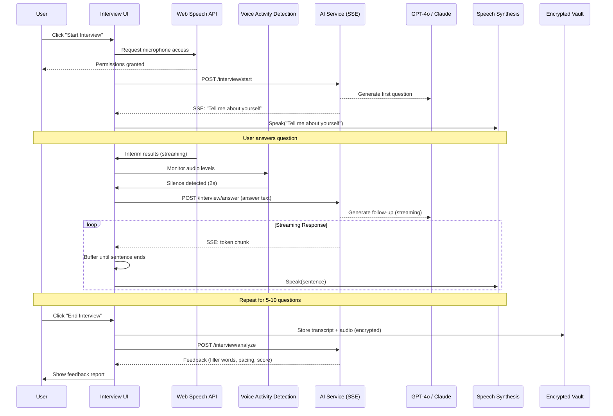

# Voice Mock Interviewer: AI Interview Coach

## Goal

Build a **real-time voice-based mock interview feature** that simulates a live interview with a hiring manager. This feature:
- Uses **Web Speech API** for STT/TTS (browser-native, zero latency)
- Streams LLM responses via **Server-Sent Events** (SSE) for natural conversation flow
- Provides **post-interview analytics** (filler words, pacing, confidence scoring)
- Is **exclusive to Managed Subscription** (premium feature to drive upsells)

**Key Innovation**: Unlike competitors that use async Q&A, we deliver a **real-time conversational experience** that feels like a real interview.

## Source References

- **Implementation Basis**: `cv-app-ng-frontend/docs/implementation-plan/05-real-time-ai-interviewer.md`
- **Related Plans**:
  - `10_product_tiers_and_packaging.plan.md` (voice interviewer is Managed-only)
  - `local-first_vault_c7381a99.plan.md` (provides storage for interview transcripts)

## User Flow



## Technical Architecture

### 1. Web Speech API (STT)

**Why Browser-Native Speech?**
- ✅ **Zero latency**: No audio upload → immediate transcription
- ✅ **Free**: No transcription API costs (vs. Whisper/Deepgram)
- ✅ **Privacy**: Audio never leaves the device
- ❌ **Browser support**: Chrome/Edge (WebKit) only; no Firefox/Safari

**File**: `src/services/speechRecognitionService.ts`

```typescript
export interface TranscriptSegment {
  text: string;
  isFinal: boolean;
  timestamp: number;
}

export class SpeechRecognitionService {
  private recognition: SpeechRecognition | null = null;
  private listeners: Set<(segment: TranscriptSegment) => void> = new Set();
  
  constructor() {
    // Check browser support
    const SpeechRecognition = (window as any).SpeechRecognition || (window as any).webkitSpeechRecognition;
    
    if (!SpeechRecognition) {
      console.error('Web Speech API not supported');
      return;
    }
    
    this.recognition = new SpeechRecognition();
    this.recognition.continuous = true; // Keep listening
    this.recognition.interimResults = true; // Real-time streaming
    this.recognition.lang = 'en-US';
    
    // Event handlers
    this.recognition.onresult = (event) => {
      for (let i = event.resultIndex; i < event.results.length; i++) {
        const result = event.results[i];
        const segment: TranscriptSegment = {
          text: result[0].transcript,
          isFinal: result.isFinal,
          timestamp: Date.now()
        };
        
        this.notifyListeners(segment);
      }
    };
    
    this.recognition.onend = () => {
      // Auto-restart if still in interview mode
      if (this.recognition) {
        console.log('[STT] Recognition ended, restarting...');
        this.start();
      }
    };
    
    this.recognition.onerror = (event) => {
      console.error('[STT] Error:', event.error);
    };
  }
  
  start() {
    if (!this.recognition) throw new Error('Speech recognition not supported');
    this.recognition.start();
  }
  
  stop() {
    if (this.recognition) {
      const temp = this.recognition;
      this.recognition = null; // Prevent auto-restart
      temp.stop();
    }
  }
  
  onTranscript(callback: (segment: TranscriptSegment) => void) {
    this.listeners.add(callback);
    return () => this.listeners.delete(callback);
  }
  
  private notifyListeners(segment: TranscriptSegment) {
    this.listeners.forEach(listener => listener(segment));
  }
}
```

### 2. Voice Activity Detection (VAD)

**Why VAD?**
- Web Speech API's silence detection is aggressive (cuts off mid-sentence)
- Custom VAD allows tuning threshold and timeout

**File**: `src/services/voiceActivityDetection.ts`

```typescript
export class VoiceActivityDetectionService {
  private audioContext: AudioContext | null = null;
  private analyser: AnalyserNode | null = null;
  private dataArray: Uint8Array | null = null;
  private rafId: number | null = null;
  private isSpeaking = false;
  private silenceTimeout: NodeJS.Timeout | null = null;
  
  private listeners: Set<(isSpeaking: boolean) => void> = new Set();
  
  async start(stream: MediaStream) {
    this.audioContext = new AudioContext();
    const source = this.audioContext.createMediaStreamSource(stream);
    
    this.analyser = this.audioContext.createAnalyser();
    this.analyser.fftSize = 512;
    this.analyser.smoothingTimeConstant = 0.8;
    
    source.connect(this.analyser);
    
    this.dataArray = new Uint8Array(this.analyser.frequencyBinCount);
    
    this.detectSpeech();
  }
  
  stop() {
    if (this.rafId) cancelAnimationFrame(this.rafId);
    if (this.audioContext) this.audioContext.close();
    this.audioContext = null;
    this.analyser = null;
  }
  
  private detectSpeech() {
    if (!this.analyser || !this.dataArray) return;
    
    this.analyser.getByteFrequencyData(this.dataArray);
    
    // Calculate average volume
    const average = this.dataArray.reduce((sum, value) => sum + value, 0) / this.dataArray.length;
    
    const SPEECH_THRESHOLD = 20; // Tune based on testing
    const SILENCE_DURATION_MS = 2000; // 2 seconds of silence
    
    if (average > SPEECH_THRESHOLD) {
      // User is speaking
      if (!this.isSpeaking) {
        this.isSpeaking = true;
        this.notifyListeners(true);
      }
      
      // Clear silence timeout
      if (this.silenceTimeout) {
        clearTimeout(this.silenceTimeout);
        this.silenceTimeout = null;
      }
    } else {
      // Silence detected
      if (this.isSpeaking && !this.silenceTimeout) {
        // Start silence countdown
        this.silenceTimeout = setTimeout(() => {
          this.isSpeaking = false;
          this.notifyListeners(false);
          this.silenceTimeout = null;
        }, SILENCE_DURATION_MS);
      }
    }
    
    this.rafId = requestAnimationFrame(() => this.detectSpeech());
  }
  
  onSpeakingChange(callback: (isSpeaking: boolean) => void) {
    this.listeners.add(callback);
    return () => this.listeners.delete(callback);
  }
  
  private notifyListeners(isSpeaking: boolean) {
    this.listeners.forEach(listener => listener(isSpeaking));
  }
}
```

### 3. Streaming Interview Backend

**File**: `cv-app-ng-ai-service/app/routes/interview_routes.py`

```python
from fastapi import APIRouter, Request, Header
from fastapi.responses import StreamingResponse
from pydantic import BaseModel, Field
from typing import Optional, List
import json
from app.services.ai_service import AIService

router = APIRouter(prefix="/interview", tags=["interview"])

class InterviewStartRequest(BaseModel):
    cv_summary: str = Field(..., description="Brief CV summary for context")
    job_title: str = Field(..., description="Target job title")
    difficulty: str = Field(default="medium", description="easy, medium, hard")

class InterviewAnswerRequest(BaseModel):
    session_id: str
    question: str
    answer: str

@router.post("/start")
async def start_interview(request: InterviewStartRequest):
    """
    Start a new interview session and return the first question.
    """
    session_id = f"interview_{int(time.time())}"
    
    # Generate first question
    prompt = f"""You are a hiring manager interviewing a candidate for a {request.job_title} position.
    
Candidate Summary: {request.cv_summary}

Ask an engaging opening question (e.g., "Tell me about yourself and why you're interested in this role").
Keep it conversational and natural. Do not include any preamble, just the question."""
    
    ai_service = AIService()
    first_question = await ai_service.generate_completion(prompt, max_tokens=100)
    
    return {
        "session_id": session_id,
        "question": first_question.strip()
    }

@router.post("/answer")
async def handle_answer(request: InterviewAnswerRequest):
    """
    Process user's answer and stream the next question via SSE.
    """
    async def generate():
        prompt = f"""You are a hiring manager conducting an interview.

Previous Question: {request.question}
Candidate's Answer: {request.answer}

Generate a natural follow-up question based on their answer. Be conversational and probe for specifics.
Do not include any preamble, just the question."""
        
        ai_service = AIService()
        
        async for chunk in ai_service.stream_completion(prompt, max_tokens=150):
            yield f"data: {json.dumps({'chunk': chunk})}\n\n"
        
        yield "data: [DONE]\n\n"
    
    return StreamingResponse(generate(), media_type="text/event-stream")
```

### 4. Optimistic TTS (Client-Side)

**File**: `src/services/textToSpeechService.ts`

```typescript
export class TextToSpeechService {
  private synthesis: SpeechSynthesis;
  private voice: SpeechSynthesisVoice | null = null;
  private buffer: string = '';
  
  constructor() {
    this.synthesis = window.speechSynthesis;
    
    // Wait for voices to load
    if (this.synthesis.getVoices().length === 0) {
      this.synthesis.addEventListener('voiceschanged', () => {
        this.selectVoice();
      });
    } else {
      this.selectVoice();
    }
  }
  
  private selectVoice() {
    const voices = this.synthesis.getVoices();
    // Prefer natural-sounding female voice
    this.voice = voices.find(v => v.name.includes('Samantha') || v.name.includes('Google US English')) || voices[0];
  }
  
  /**
   * Add token to buffer and speak when a complete sentence is detected.
   */
  addToken(token: string) {
    this.buffer += token;
    
    // Check for sentence boundary
    if (/[.!?]\s*$/.test(this.buffer.trim())) {
      this.speakSentence(this.buffer.trim());
      this.buffer = '';
    }
  }
  
  /**
   * Flush remaining buffer (end of stream).
   */
  flush() {
    if (this.buffer.trim()) {
      this.speakSentence(this.buffer.trim());
      this.buffer = '';
    }
  }
  
  private speakSentence(text: string) {
    const utterance = new SpeechSynthesisUtterance(text);
    
    if (this.voice) {
      utterance.voice = this.voice;
    }
    
    utterance.rate = 1.0; // Normal speed
    utterance.pitch = 1.0;
    utterance.volume = 1.0;
    
    this.synthesis.speak(utterance);
  }
  
  /**
   * Cancel all pending speech.
   */
  cancel() {
    this.synthesis.cancel();
    this.buffer = '';
  }
}
```

### 5. Interview UI Component

**File**: `src/pages/InterviewPage.tsx`

```typescript
import React, { useState, useEffect, useRef } from 'react';
import { Button, Text, Stack, Card, Badge, Progress } from '@mantine/core';
import { IconMicrophone, IconMicrophoneOff } from '@tabler/icons-react';
import { SpeechRecognitionService } from '../services/speechRecognitionService';
import { VoiceActivityDetectionService } from '../services/voiceActivityDetection';
import { TextToSpeechService } from '../services/textToSpeechService';
import { apiService } from '../services/api';

export const InterviewPage: React.FC = () => {
  const [sessionId, setSessionId] = useState<string | null>(null);
  const [currentQuestion, setCurrentQuestion] = useState<string>('');
  const [userAnswer, setUserAnswer] = useState<string>('');
  const [isListening, setIsListening] = useState(false);
  const [isSpeaking, setIsSpeaking] = useState(false);
  const [questionCount, setQuestionCount] = useState(0);
  
  const sttRef = useRef(new SpeechRecognitionService());
  const vadRef = useRef(new VoiceActivityDetectionService());
  const ttsRef = useRef(new TextToSpeechService());
  
  const startInterview = async () => {
    // Request mic access
    const stream = await navigator.mediaDevices.getUserMedia({ audio: true });
    
    // Start services
    sttRef.current.start();
    vadRef.current.start(stream);
    
    // Get first question
    const response = await apiService.startInterview({
      cv_summary: 'Software engineer with 5 years experience',
      job_title: 'Senior Engineer',
      difficulty: 'medium'
    });
    
    setSessionId(response.session_id);
    setCurrentQuestion(response.question);
    setQuestionCount(1);
    
    // Speak first question
    ttsRef.current.addToken(response.question);
    ttsRef.current.flush();
    
    setIsListening(true);
  };
  
  useEffect(() => {
    // Listen for transcription
    const unsubSTT = sttRef.current.onTranscript((segment) => {
      if (segment.isFinal) {
        setUserAnswer(prev => prev + ' ' + segment.text);
      }
    });
    
    // Listen for VAD (silence detection)
    const unsubVAD = vadRef.current.onSpeakingChange((speaking) => {
      setIsSpeaking(speaking);
      
      if (!speaking && userAnswer.trim()) {
        // User stopped speaking → submit answer
        submitAnswer();
      }
    });
    
    return () => {
      unsubSTT();
      unsubVAD();
    };
  }, [userAnswer]);
  
  const submitAnswer = async () => {
    if (!sessionId || !userAnswer.trim()) return;
    
    setIsListening(false);
    
    // Stream next question
    const eventSource = await apiService.streamInterviewAnswer({
      session_id: sessionId,
      question: currentQuestion,
      answer: userAnswer
    });
    
    eventSource.onmessage = (event) => {
      if (event.data === '[DONE]') {
        ttsRef.current.flush();
        setIsListening(true);
        return;
      }
      
      const { chunk } = JSON.parse(event.data);
      ttsRef.current.addToken(chunk);
      setCurrentQuestion(prev => prev + chunk);
    };
    
    // Reset for next question
    setUserAnswer('');
    setQuestionCount(prev => prev + 1);
  };
  
  const endInterview = () => {
    sttRef.current.stop();
    vadRef.current.stop();
    ttsRef.current.cancel();
    setIsListening(false);
    
    // Navigate to feedback page
  };
  
  return (
    <Stack align="center" p="xl" maw={800} mx="auto">
      <Text size="xl" fw={700}>Mock Interview</Text>
      <Badge>Question {questionCount} / 10</Badge>
      
      {!sessionId ? (
        <Button onClick={startInterview} size="lg">
          Start Interview
        </Button>
      ) : (
        <>
          <Card shadow="sm" p="lg" w="100%">
            <Text fw={600} mb="sm">Interviewer:</Text>
            <Text>{currentQuestion}</Text>
          </Card>
          
          <Card shadow="sm" p="lg" w="100%" bg={isListening ? 'blue.0' : 'gray.0'}>
            <Stack align="center">
              {isListening ? <IconMicrophone size={48} /> : <IconMicrophoneOff size={48} />}
              <Text c="dimmed">{isSpeaking ? 'Listening...' : 'Waiting for response...'}</Text>
              <Text size="sm">{userAnswer}</Text>
            </Stack>
          </Card>
          
          <Button onClick={endInterview} color="red">
            End Interview
          </Button>
        </>
      )}
    </Stack>
  );
};
```

## Post-Interview Analytics

**File**: `src/utils/interviewAnalytics.ts`

```typescript
export interface InterviewAnalytics {
  fillerWordCount: number;
  wordsPerMinute: number;
  confidenceScore: number;
  suggestions: string[];
}

export function analyzeTranscript(transcript: string, durationSeconds: number): InterviewAnalytics {
  // Filler word detection
  const fillerWords = transcript.match(/\b(um|uh|like|you know|sort of|kind of)\b/gi) || [];
  
  // Words per minute
  const wordCount = transcript.split(/\s+/).length;
  const wpm = Math.round((wordCount / durationSeconds) * 60);
  
  // Confidence scoring (simple heuristic)
  const hedgingPhrases = transcript.match(/\b(i think|maybe|probably|i guess)\b/gi) || [];
  const confidenceScore = Math.max(0, 100 - (hedgingPhrases.length * 5));
  
  // Suggestions
  const suggestions: string[] = [];
  if (fillerWords.length > 10) {
    suggestions.push('Reduce filler words by pausing instead of saying "um" or "like"');
  }
  if (wpm < 100) {
    suggestions.push('Speak slightly faster to maintain engagement');
  }
  if (wpm > 180) {
    suggestions.push('Slow down to ensure clarity');
  }
  
  return {
    fillerWordCount: fillerWords.length,
    wordsPerMinute: wpm,
    confidenceScore,
    suggestions
  };
}
```

## Tier Gating (Managed-Only)

**File**: `src/pages/InterviewPage.tsx` (add tier check)

```typescript
import { useTier } from '../contexts/TierContext';

export const InterviewPage: React.FC = () => {
  const { hasFeature, showUpgradeModal } = useTier();
  
  if (!hasFeature('canUseMockInterviewer')) {
    return (
      <Stack align="center" p="xl">
        <Text size="xl" fw={700}>Voice Mock Interviewer</Text>
        <Text c="dimmed">Exclusive to Managed Subscription</Text>
        <Button onClick={() => showUpgradeModal('Voice Interviewer')}>
          Upgrade to Managed Pro
        </Button>
      </Stack>
    );
  }
  
  // ... rest of component
};
```

## Non-Goals (This Plan)

- ❌ Video interview simulation (voice-only for MVP)
- ❌ Multi-language support (English only)
- ❌ Custom interviewer personalities (single AI persona)

## Acceptance Criteria

- ✅ Web Speech API STT works with continuous recognition
- ✅ VAD detects when user stops speaking (2s silence threshold)
- ✅ SSE streaming works for LLM responses
- ✅ Optimistic TTS speaks first sentence while LLM generates rest
- ✅ Interview transcripts are stored in encrypted vault
- ✅ Post-interview analytics (filler words, WPM, confidence score) work
- ✅ Feature is gated to Managed Subscription tier

## Open Questions

1. **Browser support**: How do we handle users on Firefox/Safari (no Web Speech API)? (Suggestion: show "Use Chrome" message or offer text-based fallback)
2. **Interview length**: How many questions per session? (Suggestion: 5-10 questions, ~10-15 minutes)
3. **AI personality**: Should the interviewer be friendly or challenging? (Suggestion: user-selectable mode)

## Implementation Checklist

- [ ] **`design-interview-flow-ux`**: Finalize UX flow and UI mockups
- [ ] **`implement-web-speech-stt`**: Implement STT with continuous recognition
- [ ] **`implement-vad-logic`**: Implement VAD with threshold tuning
- [ ] **`add-streaming-interview-endpoint`**: Add SSE endpoint to AI service
- [ ] **`implement-optimistic-tts`**: Implement sentence buffering + TTS
- [ ] **`add-transcript-storage`**: Store transcripts in encrypted vault
- [ ] **`implement-feedback-analytics`**: Build post-interview analytics
- [ ] **`add-tier-gating`**: Gate feature to Managed tier

## Related Plans

- **`10_product_tiers_and_packaging.plan.md`**: Voice interviewer is Managed-only
- **`local-first_vault_c7381a99.plan.md`**: Provides storage for interview transcripts
- **`11_licensing_and_gating_lemonsqueezy.plan.md`**: Powers tier validation

