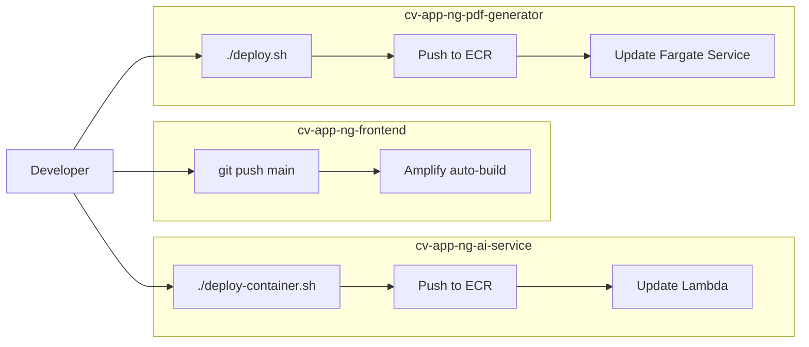
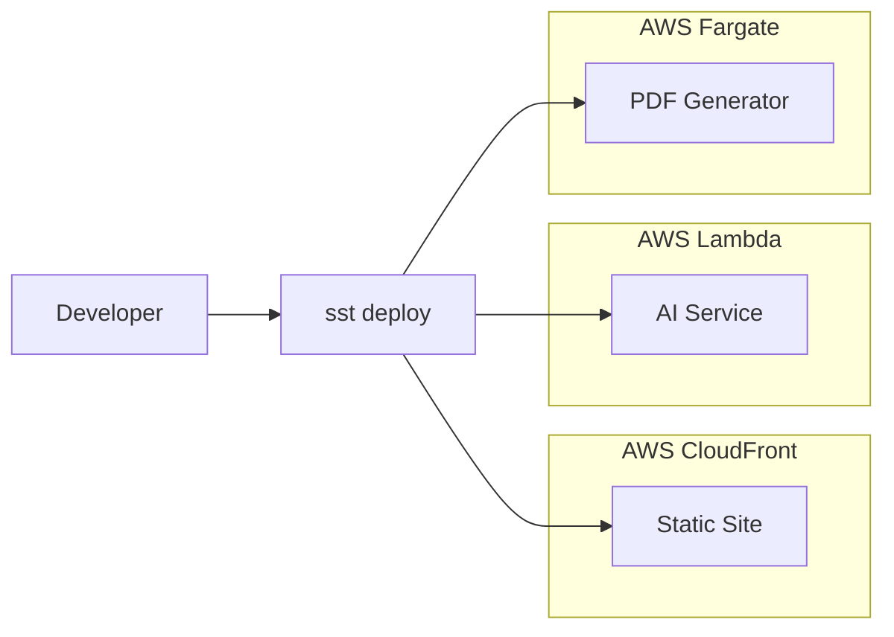

# SST v3 Monorepo Migration (Optional)

## Goal

This is a **decision record + migration plan** for optionally adopting **SST (Serverless Stack) v3** to unify infrastructure management. This plan:

- Evaluates whether SST solves real pain points (vs. adding complexity)
- Documents the trade-offs between multi-repo (current) vs SST monorepo
- Provides a phased migration path **if** the decision is "yes"
- **Defers execution** until evidence shows it's needed (Phase 5, Q3–Q4 2025)

**Decision Threshold**: Migrate to SST only if:

- Manual deployment scripts are breaking frequently
- Cross-repo dependency management is painful
- We need advanced AWS features (e.g., EventBridge, Step Functions) that SST makes easier

## Source References

- **AWS Architecture Blueprint**: `cv-app-ng-frontend/AWS AI CV Builder Architecture Blueprint.md` § "SST v3 Deployment Architecture"
- **Related Plans**:
- `00_master_roadmap.plan.md` (lists SST migration as Phase 5 / optional)
- `sst_pdf_lambda_99038d1a.plan.md` (existing plan for PDF Lambda migration)

## Current State (Multi-Repo Deployment)

### Repos & Deployment Methods

| Repo | Deployment Method | Tools | Pain Points ||------|------------------|-------|-------------|| **`cv-app-ng-frontend`** | Amplify (AWS managed) | `amplify.yml` | ✅ Zero-config; ❌ Slow builds || **`cv-app-ng-ai-service`** | Lambda (manual deploy script) | `deploy-container.sh` + ECR | ❌ No auto-rollback; ❌ Manual env vars || **`cv-app-ng-pdf-generator`** | Fargate (manual deploy script) | `deploy.sh` + ECR + ALB | ❌ Complex networking; ❌ Manual scaling config |

### Deployment Workflow (Current)



**Pain Points**:

- ❌ **No unified CI/CD**: 3 separate deploy commands
- ❌ **No shared config**: Env vars duplicated across services
- ❌ **No dependency tracking**: Changing AI service API requires manual frontend update
- ❌ **No preview deployments**: Can't easily spin up a full stack for PRs
- ❌ **Manual rollbacks**: No built-in rollback mechanism

## SST v3 Architecture (Proposed)

### What is SST?

**SST (Serverless Stack)** is an open-source framework for building full-stack serverless apps on AWS. It provides:

- **Type-safe infrastructure as code** (TypeScript/JS)
- **Live Lambda Dev** (test Lambdas locally with hot reload)
- **Unified deployments** (one command deploys entire stack)
- **OIDC-based CI/CD** (no long-lived AWS credentials)
- **Cross-stack outputs** (e.g., API URL automatically injected into frontend)

### SST Monorepo Structure

```javascript
resumint-monorepo/
  sst.config.ts                  ← SST configuration
  packages/
    frontend/                    ← React app (Vite)
      src/
      vite.config.ts
      package.json
    ai-service/                  ← FastAPI Lambda
      app/
      requirements.txt
    pdf-service/                 ← FastAPI Fargate (or Lambda)
      app/
      requirements.txt
    shared/                      ← Shared TypeScript types
      src/
        types.ts
  infra/
    frontend.ts                  ← SST StaticSite construct
    ai-service.ts                ← SST Function construct
    pdf-service.ts               ← SST Service (Fargate) or Function
    database.ts                  ← DynamoDB tables
    queue.ts                     ← SQS queues
  .github/
    workflows/
      deploy.yml                 ← OIDC-based CI/CD
```


### SST Config Example

**File**: `sst.config.ts`

```typescript
import { SSTConfig } from 'sst';
import { Frontend } from './infra/frontend';
import { AIService } from './infra/ai-service';
import { PDFService } from './infra/pdf-service';

export default {
  config(_input) {
    return {
      name: 'resumint',
      region: 'us-east-1',
    };
  },
  stacks(app) {
    app.stack(AIService).stack(PDFService).stack(Frontend);
  },
} satisfies SSTConfig;
```

**File**: `infra/ai-service.ts`

```typescript
import { StackContext, Function, Queue, Table } from 'sst/constructs';

export function AIService({ stack }: StackContext) {
  // DynamoDB table for job metadata
  const jobsTable = new Table(stack, 'Jobs', {
    fields: {
      jobId: 'string',
    },
    primaryIndex: { partitionKey: 'jobId' },
  });
  
  // SQS queue for async jobs
  const jobQueue = new Queue(stack, 'JobQueue');
  
  // Lambda function (FastAPI via Mangum)
  const api = new Function(stack, 'AIService', {
    handler: 'packages/ai-service/app/main.handler',
    runtime: 'python3.11',
    environment: {
      JOBS_TABLE: jobsTable.tableName,
      JOB_QUEUE_URL: jobQueue.queueUrl,
    },
    permissions: [jobsTable, jobQueue],
  });
  
  // Expose outputs for frontend
  stack.addOutputs({
    AIServiceUrl: api.url,
  });
  
  return { api, jobsTable, jobQueue };
}
```

**File**: `infra/frontend.ts`

```typescript
import { StackContext, StaticSite, use } from 'sst/constructs';
import { AIService } from './ai-service';
import { PDFService } from './pdf-service';

export function Frontend({ stack }: StackContext) {
  const { api: aiApi } = use(AIService);
  const { api: pdfApi } = use(PDFService);
  
  const site = new StaticSite(stack, 'Frontend', {
    path: 'packages/frontend',
    buildCommand: 'npm run build',
    buildOutput: 'dist',
    environment: {
      VITE_AI_SERVICE_URL: aiApi.url,
      VITE_PDF_SERVICE_URL: pdfApi.url,
    },
  });
  
  stack.addOutputs({
    SiteUrl: site.url,
  });
}
```


### Deployment Workflow (SST)



**One Command**:

```bash
npm run deploy  # Deploys entire stack
```


## Trade-Off Analysis

### Pros of SST Migration

| Benefit | Impact ||---------|--------|| **Unified deployments** | One command deploys entire stack (faster iteration) || **Type-safe config** | Catch IaC errors at build time (TypeScript) || **Cross-stack outputs** | API URLs auto-injected into frontend (no manual env vars) || **Preview deployments** | Spin up full stack for PRs (better testing) || **OIDC CI/CD** | No long-lived AWS credentials (better security) || **Live Lambda Dev** | Test Lambdas locally with hot reload (faster dev loop) |

### Cons of SST Migration

| Drawback | Impact ||----------|--------|| **Monorepo complexity** | Harder to navigate; build/test scripts more complex || **Learning curve** | Team must learn SST APIs and TypeScript IaC || **Migration effort** | ~2-3 weeks to migrate all 3 repos + test || **Vendor lock-in** | SST is AWS-only (but so is current setup) || **Fargate constraints** | PDF service may not fit Lambda (Playwright size); SST Service (Fargate) adds complexity |

## Decision Framework

### When to Migrate to SST

**Migrate if 2+ of these are true**:

- [ ] We're adding 2+ more services (e.g., RAG service, analytics service)
- [ ] Manual deployment scripts are breaking weekly
- [ ] We need cross-stack dependencies (e.g., EventBridge triggering Lambda)
- [ ] We want preview deployments for PRs
- [ ] We're hiring engineers who prefer TypeScript IaC

### When to Stay Multi-Repo

**Stay multi-repo if**:

- [x] Current deployment scripts work fine
- [x] Only 3 repos (manageable by hand)
- [x] Team prefers Python/bash over TypeScript
- [x] No immediate need for preview deployments

### Current Recommendation (Dec 2025)

**DEFER SST migration to Phase 5** (Q3–Q4 2025). Revisit if:

- We add 2+ new services (e.g., RAG service, licensing API)
- Deployment friction becomes a blocker
- We hire a DevOps engineer who champions SST

## Migration Path (If Approved)

### Phase 1: Proof of Concept (1 week)

1. Create new SST project
2. Deploy one Lambda (AI service extract endpoint)
3. Deploy one static site (frontend homepage)
4. Validate OIDC CI/CD works

### Phase 2: Migrate AI Service (1 week)

1. Move `cv-app-ng-ai-service` → `packages/ai-service`
2. Convert DynamoDB/SQS to SST constructs
3. Test async jobs flow
4. Deprecate old Lambda deploy script

### Phase 3: Migrate Frontend (1 week)

1. Move `cv-app-ng-frontend` → `packages/frontend`
2. Use SST `StaticSite` construct
3. Inject API URLs via SST outputs
4. Deprecate Amplify

### Phase 4: Migrate PDF Service (1 week)

1. **Option A**: Keep Fargate (use SST `Service` construct)
2. **Option B**: Migrate to Lambda (see `sst_pdf_lambda_99038d1a.plan.md`)
3. Test PDF generation
4. Deprecate Fargate deploy script

### Phase 5: CI/CD + Cleanup

1. Add OIDC GitHub Actions workflow
2. Add preview deployments for PRs
3. Archive old repos (keep as read-only reference)
4. Update docs

## Non-Goals (This Plan)

- ❌ Forcing SST adoption (it's optional)
- ❌ Migrating before pain points justify the effort
- ❌ Rewriting services to fit SST patterns (use adapters if needed)

## Acceptance Criteria (If Migration Approved)

- ✅ SST PoC deploys successfully (one Lambda + one static site)
- ✅ All 3 services migrated to SST monorepo
- ✅ OIDC CI/CD works (no long-lived credentials)
- ✅ Preview deployments work for PRs
- ✅ Deployment time < 5 minutes for full stack
- ✅ Team trained on SST workflows

## Open Questions

1. **Fargate in SST**: Can SST Service handle Playwright? (Answer: yes, but adds complexity)
2. **Shared types**: How do we share TypeScript types between frontend and services? (Answer: `packages/shared` package)
3. **Cost**: Does SST add AWS costs? (Answer: no, it's just IaC; resource costs are the same)

## Implementation Checklist

- [ ] **`evaluate-multi-repo-pain-points`**: Document current pain points (deploy friction, config duplication)
- [ ] **`create-sst-poc-project`**: Build PoC with one Lambda + one static site
- [ ] **`compare-sst-vs-current-deployment`**: Benchmark deploy speed, complexity, DX
- [ ] **`decide-monorepo-vs-multi-repo`**: Make go/no-go decision (requires stakeholder buy-in)
- [ ] **`design-sst-monorepo-structure`**: Design folder structure, shared packages, CI/CD
- [ ] **`migrate-frontend-to-sst`**: Move frontend to SST StaticSite
- [ ] **`migrate-ai-service-to-sst`**: Move AI service to SST Function
- [ ] **`migrate-pdf-service-to-sst`**: Move PDF service (or keep Fargate with SST Service)

## Related Plans

- **`00_master_roadmap.plan.md`**: Lists SST migration as Phase 5 / optional