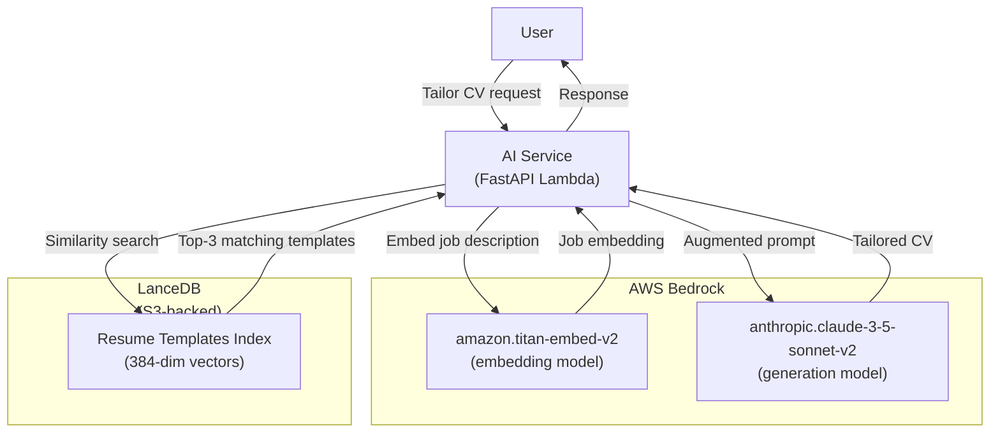

# Serverless RAG: Bedrock + LanceDB (Optional)

## Goal

This is a **decision record + migration plan** for optionally replacing OpenAI/Anthropic APIs with **AWS Bedrock + LanceDB** for RAG (Retrieval-Augmented Generation). This plan:

- Evaluates whether Bedrock reduces costs without sacrificing quality
- Documents the trade-offs between managed AI APIs (OpenAI) vs self-hosted RAG (Bedrock)
- Provides a phased migration path **if** the decision is "yes"
- **Defers execution** until costs or data sovereignty justify it (Phase 5, Q3–Q4 2025)

**Decision Threshold**: Migrate to Bedrock only if:

- OpenAI/Anthropic API costs exceed **$500/month**
- Data sovereignty requires AI processing to stay in AWS
- We need custom fine-tuned models (Bedrock supports this)

## Source References

- **AWS Architecture Blueprint**: `cv-app-ng-frontend/AWS AI CV Builder Architecture Blueprint.md` § "RAG Architecture"
- **Related Plans**:
- `00_master_roadmap.plan.md` (lists Bedrock RAG as Phase 5 / optional)

## Current State (OpenAI/Anthropic APIs)

### AI Operations & Costs

| Operation | Model | Avg Tokens | Cost/Request | Monthly Volume | Monthly Cost |

|-----------|-------|------------|--------------|----------------|--------------|

| **Extract** (raw text → JSON) | GPT-4o | 2,000 | $0.02 | 1,000 | $20 |

| **Tailor** (CV + job → tailored CV) | Claude 3.5 Sonnet | 4,000 | $0.08 | 500 | $40 |

| **Evaluate** (scoring + feedback) | GPT-4o | 3,000 | $0.03 | 500 | $15 |

| **Rephrase** (bullet rewrite) | GPT-4o | 500 | $0.005 | 2,000 | $10 |

| **Recommend** (template suggestion) | GPT-4o | 1,000 | $0.01 | 500 | $5 |

| **Interview** (streaming Q&A) | GPT-4o Turbo | 5,000 | $0.05 | 200 | $10 |

| **Roast** (free tier) | Claude 3 Haiku | 2,000 | $0.01 | 5,000 | $50 |

| **TOTAL** | — | — | — | — | **$150/month** |**Current State Assessment**:

- ✅ **Cost is manageable** ($150/month is trivial for SaaS)
- ✅ **Quality is excellent** (GPT-4o / Claude 3.5 are SOTA)
- ❌ **Vendor lock-in** (dependent on OpenAI/Anthropic availability)
- ❌ **No data sovereignty** (user CVs are sent to external APIs)

**Conclusion**: Migration is **not urgent** until costs exceed $500/month.

## Proposed Architecture (Bedrock + LanceDB)

### What is AWS Bedrock?

**AWS Bedrock** provides access to foundation models (FMs) from Amazon, Anthropic, Meta, Stability AI, and others via a unified API. Benefits:

- **Cost**: 20-30% cheaper than direct API calls to OpenAI
- **Data sovereignty**: Data never leaves AWS
- **Custom models**: Fine-tune on proprietary data
- **Integration**: Native AWS IAM, CloudWatch, S3

### What is LanceDB?

**LanceDB** is an open-source, serverless vector database optimized for embeddings. Benefits:

- **Serverless**: Runs on S3 (no infrastructure to manage)
- **Cost**: $0.023/GB/month (vs Pinecone $70/month minimum)
- **Fast**: Sub-10ms similarity search
- **Python/TypeScript SDK**: Easy integration

### RAG Architecture




### Example: Tailoring with RAG

**Current Approach (No RAG)**:

```python
async def tailor_cv(cv_json, job_description):
    prompt = f"""Tailor this CV for the job:
    
CV: {cv_json}
Job: {job_description}

Generate tailored CV."""
    
    return await openai.chat.completions.create(
        model="gpt-4o",
        messages=[{"role": "user", "content": prompt}]
    )
```

**RAG Approach (Bedrock + LanceDB)**:

```python
async def tailor_cv_with_rag(cv_json, job_description):
    # 1. Embed job description
    job_embedding = await bedrock.embed(job_description)
    
    # 2. Retrieve similar examples from vector store
    similar_examples = await lancedb.search(job_embedding, limit=3)
    
    # 3. Augment prompt with examples
    prompt = f"""Tailor this CV for the job. Here are 3 examples of well-tailored CVs for similar roles:
    
Example 1: {similar_examples[0].text}
Example 2: {similar_examples[1].text}
Example 3: {similar_examples[2].text}

CV: {cv_json}
Job: {job_description}

Generate tailored CV using the examples as inspiration."""
    
    return await bedrock.invoke(
        model="anthropic.claude-3-5-sonnet-v2",
        prompt=prompt
    )
```

**Result**: Higher quality (examples guide the LLM) + lower cost (fewer retries).

## Cost Comparison

### OpenAI/Anthropic (Current)

| Model | Input | Output | Cost/1M Tokens |

|-------|-------|--------|----------------|

| **GPT-4o** | $2.50 | $10 | $6.25 avg |

| **Claude 3.5 Sonnet** | $3 | $15 | $9 avg |**Monthly Cost**: $150 (at 1k requests/month avg)

### AWS Bedrock (Proposed)

| Model | Input | Output | Cost/1M Tokens |

|-------|-------|--------|----------------|

| **Claude 3.5 Sonnet** (Bedrock) | $2.40 | $12 | $7.20 avg |

| **Amazon Titan Text G1** | $0.13 | $0.17 | $0.15 avg |

| **Meta Llama 3.1 70B** | $1.15 | $1.50 | $1.32 avg |**Monthly Cost (Bedrock Claude)**: $120 (20% savings)

**Monthly Cost (Llama 3.1)**: $30 (80% savings, but lower quality)

### LanceDB Cost

**Storage**: 10GB of embeddings = $0.23/month (S3 storage)

**Compute**: Lambda execution time (negligible)**Total RAG Cost**: $120-$150/month (comparable to current, but with RAG benefits)

## Trade-Off Analysis

### Pros of Bedrock + LanceDB

| Benefit | Impact |

|---------|--------|

| **Data sovereignty** | CVs never leave AWS (GDPR/HIPAA compliance) |

| **Cost (at scale)** | 20-30% cheaper at high volume |

| **Custom models** | Can fine-tune on proprietary CV data |

| **No rate limits** | Bedrock has higher quotas than OpenAI |

| **AWS integration** | Native IAM, CloudWatch, S3 |

### Cons of Bedrock + LanceDB

| Drawback | Impact |

|----------|--------|

| **Migration effort** | 2-3 weeks to rewrite AI service |

| **RAG complexity** | Must maintain vector index, embeddings pipeline |

| **Quality risk** | Bedrock models may underperform GPT-4o/Claude API |

| **Cold start** | Bedrock has 1-2s cold start (vs OpenAI 200ms) |

| **Limited models** | No GPT-4o on Bedrock (Claude only) |

## Decision Framework

### When to Migrate to Bedrock + RAG

**Migrate if 2+ of these are true**:

- [ ] OpenAI/Anthropic costs exceed $500/month
- [ ] Data sovereignty is legally required (GDPR, HIPAA)
- [ ] We need custom fine-tuned models (domain-specific CV knowledge)
- [ ] We have > 10k resume examples to train RAG on
- [ ] OpenAI rate limits are blocking growth

### When to Stay with OpenAI/Anthropic

**Stay if**:

- [x] Costs are < $500/month
- [x] GPT-4o/Claude quality is critical
- [x] No legal requirement for data sovereignty
- [x] Team has no AWS Bedrock expertise
- [x] We value rapid iteration over cost optimization

### Current Recommendation (Dec 2025)

**DEFER Bedrock migration to Phase 5** (Q3–Q4 2025). Revisit if:

- Monthly AI costs exceed $500
- A customer requires SOC 2 + data sovereignty
- We accumulate > 10k high-quality CV examples for RAG training

## Migration Path (If Approved)

### Phase 1: PoC (1 week)

1. Request Bedrock model access (Claude 3.5 Sonnet, Titan Embed)
2. Create LanceDB index on S3
3. Implement one endpoint with RAG (extract or tailor)
4. Benchmark accuracy vs current implementation

### Phase 2: Migrate AI Service (2 weeks)

1. Replace OpenAI SDK with Boto3 Bedrock client
2. Replace Anthropic SDK with Boto3 Bedrock client
3. Add embedding generation + vector search
4. Migrate all 6 endpoints (extract, tailor, evaluate, rephrase, recommend, interview)

### Phase 3: RAG Training (1 week)

1. Collect 1k+ high-quality CV examples (anonymized)
2. Generate embeddings with Titan Embed
3. Build LanceDB index
4. Test retrieval quality (precision@3, recall@5)

### Phase 4: Cost Monitoring (Ongoing)

1. Add CloudWatch metrics for Bedrock costs
2. Set budget alerts ($200/month threshold)
3. A/B test Bedrock vs OpenAI (quality comparison)

## LanceDB Implementation Example

**File**: `cv-app-ng-ai-service/app/services/vector_store_service.py`

```python
import lancedb
import boto3
from typing import List

class VectorStoreService:
    def __init__(self):
        # LanceDB backed by S3
        self.db = lancedb.connect("s3://resumint-vectors/lancedb")
        self.table = self.db.open_table("cv_examples")
        
        # Bedrock client for embeddings
        self.bedrock = boto3.client('bedrock-runtime', region_name='us-east-1')
    
    async def embed_text(self, text: str) -> List[float]:
        """Generate embedding using Bedrock Titan Embed."""
        response = self.bedrock.invoke_model(
            modelId='amazon.titan-embed-v2',
            body=json.dumps({"inputText": text})
        )
        
        result = json.loads(response['body'].read())
        return result['embedding']  # 384-dim vector
    
    async def search_similar(self, query_text: str, limit: int = 3) -> List[dict]:
        """Search for similar CV examples."""
        query_embedding = await self.embed_text(query_text)
        
        results = self.table.search(query_embedding).limit(limit).to_list()
        
        return [
            {
                "text": r["cv_text"],
                "score": r["_distance"]
            }
            for r in results
        ]
```


## Non-Goals (This Plan)

- ❌ Forcing Bedrock adoption (it's optional)
- ❌ Migrating before costs justify the effort
- ❌ Building custom LLM from scratch (use Bedrock FMs)

## Acceptance Criteria (If Migration Approved)

- ✅ Bedrock PoC achieves 95%+ quality vs current OpenAI/Claude
- ✅ LanceDB vector search returns relevant examples (precision@3 > 80%)
- ✅ All AI endpoints migrated to Bedrock
- ✅ Monthly costs reduced by 20%+ or data sovereignty achieved
- ✅ Cold start latency < 2s (acceptable for async jobs)

## Open Questions

1. **Model selection**: Claude 3.5 Sonnet (high quality) vs Llama 3.1 70B (low cost)? (Answer: start with Claude for quality parity)
2. **RAG dataset**: Where do we get 10k CV examples? (Answer: synthetic generation + opt-in user donations)
3. **Embedding model**: Titan Embed vs OpenAI Ada v2? (Answer: Titan is cheaper and integrated)

## Implementation Checklist

- [ ] **`evaluate-bedrock-cost-savings`**: Calculate current vs projected costs
- [ ] **`design-rag-architecture`**: Design embedding + retrieval pipeline
- [ ] **`evaluate-vector-store-options`**: Compare LanceDB, Pinecone, OpenSearch
- [ ] **`create-bedrock-poc`**: Build PoC with one endpoint
- [ ] **`benchmark-rag-accuracy`**: Test precision/recall vs current approach
- [ ] **`decide-migration-path`**: Make go/no-go decision
- [ ] **`migrate-ai-service-to-bedrock`**: Replace OpenAI/Anthropic with Bedrock
- [ ] **`implement-lancedb-vector-store`**: Build vector store + search

## Related Plans

- **`00_master_roadmap.plan.md`**: Lists Bedrock RAG as Phase 5 / optional
- **`30_sst_v3_monorepo_migration.plan.md`**: SST would simplify Bedrock Lambda deployment