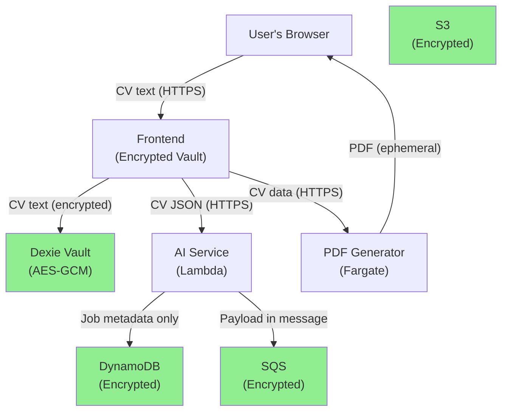

# Security & Data Sovereignty

## Goal

Establish **security best practices** and **data sovereignty policies** to protect user PII (Personally Identifiable Information) across all services. This plan:
- Defines what data is considered sensitive
- Documents where sensitive data flows and how it's protected
- Implements guardrails to prevent accidental PII exposure (logging, errors)
- Establishes data retention and deletion policies
- Provides a compliance checklist (GDPR, CCPA)

**Non-Negotiable Principle**: User CVs, job descriptions, and interview transcripts are **highly sensitive** and must be treated as toxic waste.

## Source References

- **AWS Architecture Blueprint**: `cv-app-ng-frontend/AWS AI CV Builder Architecture Blueprint.md` § "Security & Data Sovereignty"
- **Cursor Rules**:
  - `cv-app-ng-frontend/.cursor/rules/frontend-architecture-and-feature-plans.mdc`
  - `cv-app-ng-ai-service/.cursor/rules/ai-service-architecture-and-contracts.mdc`
  - `cv-app-ng-pdf-generator/.cursor/rules/pdf-generator-architecture-and-safety.mdc`

## Threat Model

### Assets to Protect

| Asset | Sensitivity | Impact if Exposed |
|-------|-------------|-------------------|
| **CV text** (raw/structured) | 🔴 Critical | Identity theft, doxxing, blackmail |
| **Job descriptions** | 🟡 Medium | Competitor intelligence, user tracking |
| **Interview transcripts** | 🔴 Critical | Personal insights, discrimination risk |
| **User-provided API keys** | 🔴 Critical | Financial loss, API abuse |
| **License keys** (LemonSqueezy) | 🟡 Medium | Revenue loss, piracy |
| **Job metadata** (status, IDs) | 🟢 Low | Minimal risk |

### Attack Vectors

| Threat | Mitigation |
|--------|------------|
| **PII in logs** | Sanitize logs (log lengths/IDs, not content) |
| **PII in error messages** | Never return raw CV/job text in 500 errors |
| **XSS in job descriptions** | Sanitize HTML with DOMPurify + CSP |
| **SSRF in PDF generator** | Validate frontend_url against allowlist |
| **API abuse** (spam roasts) | Rate limit public endpoints |
| **Data breaches** (DB leak) | Encrypt at rest (DynamoDB, S3, Dexie) |
| **Malicious payloads** | Size limits, format validation, sandboxing |

## Data Flow & Protection Boundaries



### Protection Measures

1. **Frontend (Local-First)**
   - ✅ CV data stored in **encrypted Dexie vault** (AES-GCM)
   - ✅ Encryption key stored in `localStorage` (device-bound)
   - ✅ API keys stored in encrypted vault (never sent to backend)

2. **AI Service (Process-Only)**
   - ✅ **No raw CV/job payloads stored in DynamoDB** (metadata only)
   - ✅ Payloads travel via **SQS** (encrypted in transit + at rest)
   - ✅ Logs sanitized (log `cv_text_length`, not `cv_text`)

3. **PDF Generator (Ephemeral)**
   - ✅ PDF generated in-memory (never written to disk)
   - ✅ Frontend URL validated against allowlist (SSRF defense)
   - ✅ Logs sanitized (log request IDs, not CV data)

## Logging Sanitization (Critical)

### The Problem

**Bad Logging** (exposes PII):
```python
logger.info(f"Processing CV: {cv_text}")  # ❌ NEVER DO THIS
```

**Good Logging** (safe):
```python
logger.info(f"Processing CV (length: {len(cv_text)} chars)")  # ✅ SAFE
```

### Implementation: Logging Utility

**File**: `cv-app-ng-ai-service/app/utils/safe_logging.py`

```python
import logging
from typing import Any, Dict

logger = logging.getLogger(__name__)

def log_request_safe(endpoint: str, payload: Dict[str, Any]):
    """
    Log request metadata without exposing PII.
    """
    safe_payload = {
        "cv_text_length": len(payload.get("cv_text", "")),
        "job_description_length": len(payload.get("job_description", "")),
        "has_api_key": bool(payload.get("api_key")),
        "request_id": payload.get("request_id", "unknown")
    }
    
    logger.info(f"[{endpoint}] Request received", extra=safe_payload)

def log_error_safe(error: Exception, context: Dict[str, Any]):
    """
    Log error without exposing PII.
    """
    safe_context = {
        "error_type": type(error).__name__,
        "request_id": context.get("request_id", "unknown"),
        "user_tier": context.get("tier", "unknown")
    }
    
    logger.error(f"Request failed: {error}", extra=safe_context, exc_info=False)
```

**Usage in Routes**:
```python
from app.utils.safe_logging import log_request_safe, log_error_safe

@router.post("/extract")
async def extract_cv(request: ExtractRequest):
    log_request_safe("extract", request.dict())
    
    try:
        result = await ai_service.extract(request.cv_text)
        return result
    except Exception as e:
        log_error_safe(e, {"request_id": request.request_id, "tier": request.tier})
        raise HTTPException(status_code=500, detail="Extraction failed")
```

### Enforce in Pre-Commit Hook (Optional)

**File**: `.git/hooks/pre-commit`

```bash
#!/bin/bash
# Block commits that log PII

if grep -r "logger.*cv_text" app/; then
  echo "❌ ERROR: Logs contain cv_text (PII). Use safe_logging.py instead."
  exit 1
fi

if grep -r "logger.*job_description" app/; then
  echo "❌ ERROR: Logs contain job_description (PII). Use safe_logging.py instead."
  exit 1
fi

echo "✅ No PII in logs detected."
```

## Data Retention Policy

### Principles

1. **Local-First Data**: User CVs/jobs stay in encrypted Dexie vault (no server copy)
2. **Job Metadata**: DynamoDB items auto-expire via TTL (7 days)
3. **Interview Transcripts**: Stored locally only (no server copy)
4. **API Logs**: CloudWatch Logs retention = 7 days

### DynamoDB TTL Configuration

**File**: `cv-app-ng-ai-service/app/services/dynamo_job_repository.py`

```python
import time

class DynamoJobRepository:
    def create_job(self, job_id: str, job_type: str):
        ttl = int(time.time()) + (7 * 24 * 60 * 60)  # 7 days from now
        
        self.table.put_item(
            Item={
                "jobId": job_id,
                "jobType": job_type,
                "status": "pending",
                "createdAt": int(time.time()),
                "ttl": ttl  # DynamoDB auto-deletes after TTL
            }
        )
```

**Enable TTL in DynamoDB**:
```bash
aws dynamodb update-time-to-live \
  --table-name Jobs \
  --time-to-live-specification Enabled=true,AttributeName=ttl
```

### User Data Deletion (GDPR Right to Erasure)

**Frontend**: User can delete all local data:

**File**: `src/pages/SettingsPage.tsx`

```typescript
import { db } from '../db/ResuMintDB';

const handleDeleteAllData = async () => {
  await db.delete();  // Delete entire Dexie database
  localStorage.clear();  // Clear encryption keys
  window.location.reload();
};

<Button onClick={handleDeleteAllData} color="red">
  Delete All My Data (Cannot be undone)
</Button>
```

## Encryption at Rest

### Frontend: Dexie Vault (Already Implemented)

✅ See `local-first_vault_c7381a99.plan.md` for details:
- AES-GCM encryption
- Device-bound key in `localStorage`
- Encrypted fields: `resumes.content`, `jobs.description`, `interviews.transcript`

### Backend: DynamoDB

✅ **Enable AWS-managed encryption**:
```bash
aws dynamodb update-table \
  --table-name Jobs \
  --sse-specification Enabled=true,SSEType=KMS
```

### Backend: SQS

✅ **Enable encryption in transit + at rest**:
```bash
aws sqs set-queue-attributes \
  --queue-url https://sqs.us-east-1.amazonaws.com/123456789/JobQueue \
  --attributes KmsMasterKeyId=alias/aws/sqs
```

### Backend: S3 (if used for embeddings/RAG)

✅ **Enable default encryption**:
```bash
aws s3api put-bucket-encryption \
  --bucket resumint-vectors \
  --server-side-encryption-configuration '{"Rules":[{"ApplyServerSideEncryptionByDefault":{"SSEAlgorithm":"AES256"}}]}'
```

## Rate Limiting

### Why Rate Limiting?

**Without Rate Limiting**:
- Attacker spams `/ai/roast` endpoint → $1000 OpenAI bill
- Attacker brute-forces license keys → revenue loss

**With Rate Limiting**:
- Max 5 roasts per IP per hour
- Max 100 AI operations per API key per day

### Implementation (AI Service)

**File**: `cv-app-ng-ai-service/app/middleware/rate_limiter.py`

```python
from fastapi import Request, HTTPException
from collections import defaultdict
import time

# In-memory rate limiter (use Redis for production)
rate_limit_store = defaultdict(list)

def rate_limit(key: str, max_requests: int, window_seconds: int):
    """
    Rate limit a key (e.g., IP address or API key).
    Raises HTTPException if limit exceeded.
    """
    now = time.time()
    
    # Clean old timestamps
    rate_limit_store[key] = [
        ts for ts in rate_limit_store[key]
        if now - ts < window_seconds
    ]
    
    # Check limit
    if len(rate_limit_store[key]) >= max_requests:
        raise HTTPException(
            status_code=429,
            detail=f"Rate limit exceeded. Max {max_requests} requests per {window_seconds}s."
        )
    
    # Record this request
    rate_limit_store[key].append(now)

# Middleware
async def rate_limit_middleware(request: Request, call_next):
    # Rate limit by IP for public endpoints
    if request.url.path.startswith("/ai/roast"):
        client_ip = request.client.host
        rate_limit(f"roast:{client_ip}", max_requests=5, window_seconds=3600)
    
    # Rate limit by API key for authenticated endpoints
    api_key = request.headers.get("X-User-Api-Key")
    if api_key and request.url.path.startswith("/ai/jobs"):
        rate_limit(f"jobs:{api_key[:8]}", max_requests=100, window_seconds=86400)
    
    return await call_next(request)
```

**Wire into FastAPI**:
```python
from app.middleware.rate_limiter import rate_limit_middleware

app.middleware("http")(rate_limit_middleware)
```

## Abuse Detection

### Malicious Payloads

**Detect and block**:
- CV text > 50KB → reject (potential DoS)
- Job description > 20KB → reject
- Excessive special characters (e.g., 90% non-alphanumeric) → reject

**File**: `cv-app-ng-ai-service/app/utils/security.py` (update existing)

```python
def validate_cv_text(cv_text: str) -> str:
    """Validate and sanitize CV text."""
    if len(cv_text) > 50_000:
        raise ValueError("CV text exceeds 50KB limit")
    
    if len(cv_text) < 100:
        raise ValueError("CV text too short (min 100 chars)")
    
    # Check for excessive special characters (potential injection)
    alpha_ratio = sum(c.isalnum() or c.isspace() for c in cv_text) / len(cv_text)
    if alpha_ratio < 0.7:
        raise ValueError("CV text contains too many special characters")
    
    return cv_text.strip()
```

## Compliance Checklist

### GDPR (EU General Data Protection Regulation)

| Requirement | Status | Implementation |
|-------------|--------|----------------|
| **Right to Access** | ✅ | User can export vault data (Dexie export) |
| **Right to Erasure** | ✅ | User can delete all data (one-click in settings) |
| **Right to Portability** | ✅ | Export vault as JSON |
| **Data Minimization** | ✅ | Only store job metadata, not CV text |
| **Encryption** | ✅ | AES-GCM (frontend), KMS (backend) |
| **Breach Notification** | ⚠️ | Must notify within 72 hours if breach occurs |
| **Privacy Policy** | ⚠️ | Must publish (see below) |

### CCPA (California Consumer Privacy Act)

| Requirement | Status | Implementation |
|-------------|--------|----------------|
| **Right to Know** | ✅ | Privacy policy explains data collection |
| **Right to Delete** | ✅ | User can delete all data |
| **Right to Opt-Out** | ✅ | Cookie consent banner (existing) |
| **Do Not Sell** | ✅ | We don't sell user data |

### Privacy Policy (Required)

**File**: `cv-app-ng-frontend/public/privacy-policy.html`

**Key Points**:
1. **Data Collection**: We collect CV text, job descriptions, interview transcripts (stored locally only)
2. **Data Usage**: Used to power AI features (extraction, tailoring, matching, interviewing)
3. **Data Sharing**: CVs are sent to OpenAI/Anthropic for processing (unless BYOK mode)
4. **Data Retention**: Local data stays until user deletes; job metadata auto-deletes after 7 days
5. **User Rights**: Export, delete, opt-out of analytics
6. **Contact**: privacy@resumint.dev

## Non-Goals (This Plan)

- ❌ SOC 2 certification (too expensive for MVP; defer to enterprise)
- ❌ HIPAA compliance (not applicable; resumes are not health data)
- ❌ PCI-DSS compliance (we don't handle credit cards; LemonSqueezy does)

## Acceptance Criteria

- ✅ All PII touchpoints audited and documented
- ✅ Logs sanitized (no raw CV/job text in CloudWatch)
- ✅ Data retention policy implemented (DynamoDB TTL = 7 days)
- ✅ Encryption at rest enabled (DynamoDB, SQS, S3, Dexie)
- ✅ Rate limiting active on public endpoints
- ✅ Abuse detection rejects malicious payloads
- ✅ Privacy policy published and linked in footer

## Open Questions

1. **GDPR compliance officer**: Do we need to appoint a DPO (Data Protection Officer)? (Answer: not required unless we process > 250 employees' data; we're fine for now)
2. **Data residency**: Do we need EU region for GDPR? (Answer: no, but Bedrock migration would enable it)
3. **Breach response plan**: What's our process if DynamoDB leaks? (Answer: notify users within 72h, rotate keys, publish incident report)

## Implementation Checklist

- [ ] **`audit-pii-touchpoints`**: Document all code paths that handle PII
- [ ] **`implement-logging-sanitization`**: Add `safe_logging.py` and update all routes
- [ ] **`implement-data-retention-policy`**: Enable DynamoDB TTL (7 days)
- [ ] **`add-encryption-at-rest`**: Enable KMS for DynamoDB, SQS, S3
- [ ] **`implement-rate-limiting`**: Add rate limiter middleware
- [ ] **`add-abuse-detection`**: Add size limits and payload validation
- [ ] **`document-compliance-posture`**: Publish privacy policy + terms of service

## Related Plans

- **`local-first_vault_c7381a99.plan.md`**: Implements frontend encryption
- **`31_serverless_rag_bedrock_lancedb.plan.md`**: Bedrock enables data sovereignty
- **`11_licensing_and_gating_lemonsqueezy.plan.md`**: License validation (sensitive data)

