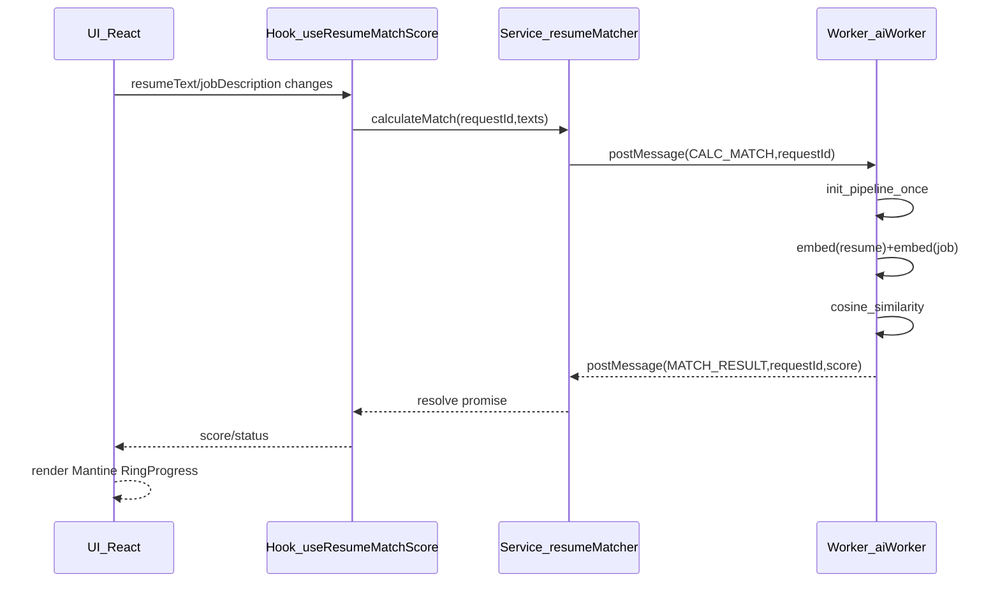

# Phase 4: Client-Side “Resume Matcher” (Transformers.js)

## Goals / non-goals

- **Goal**: Compute a semantic **Match Score** between resume content and the job description **in-browser** (no paid LLM calls), and show it as a **radial gauge in the editor Stepper/header** that updates as the user types.
- **Non-goals**: No changes to backend API contracts (`/ai/jobs/*`, `/pdf/*`). No storage or security model changes beyond avoiding any new PII logging.

## Architecture (SRP + boundaries)

- **UI components**: display only (`MatchScoreGauge`)
- **Hook**: orchestrates debouncing, cancellation, and status (`useResumeMatchScore`)
- **Service**: worker lifecycle + request/response mapping (`resumeMatcherService`)
- **Worker**: heavy compute (load model once, embed texts, cosine similarity)
- **Utils**: pure resume-to-text projection (`cvDataToText`)

## Key implementation decisions

- **Model loading**: **Download `Xenova/all-MiniLM-L6-v2` at runtime** (cached by the browser). This keeps the repo/build small.
- **Real-time updates without localStorage thrash**: do **not** push every keystroke into `useCVData` (it writes to localStorage on each change). Instead:
- `DataExtraction` and `CVForm` will emit **draft text** up to `CVStepperWizard` via optional callbacks.
- The match score uses those draft values, so it updates live, while existing “Save Changes” behavior remains intact.
- **Performance**: debounce input changes (~300–600ms), and ignore stale worker responses via `requestId`.

## Files to add / update

- **Add**: `src/workers/ai.worker.ts`
- Dedicated worker that lazily initializes `pipeline('feature-extraction', 'Xenova/all-MiniLM-L6-v2')`
- Implements `calculateMatch(resumeText, jobDescription)` internally
- Computes cosine similarity and returns `score` (0–100) + raw `similarity`
- No console logging of raw text
- **Add**: `src/services/resumeMatcher.ts`
- Creates a singleton `Worker` via `new Worker(new URL('../workers/ai.worker.ts', import.meta.url), { type: 'module' })`
- Request/response map keyed by `requestId`
- Public API: `calculateMatch(resumeText: string, jobDescription: string)`
- **Add**: `src/hooks/useResumeMatchScore.ts`
- Debounces calls to `resumeMatcher.calculateMatch`
- Handles statuses: `idle | loading_model | computing | ready | error`
- Exposes `{ score, similarity, status, error }`
- **Add**: `src/utils/cvDataToText.ts`
- Pure function to convert `CVData` → plain text (summary + experience + education + projects + skills + certifications)
- **Add**: `src/components/MatchScoreGauge.tsx`
- Mantine `RingProgress` gauge (0–100)
- Color mapping (e.g., red/yellow/green) + loading placeholder
- **Update**: `package.json`
- Add dependency: `@xenova/transformers`
- **Update**: `src/components/Stepper.tsx`
- Add prop like `headerRight?: React.ReactNode`
- Render gauge in the existing header row (next to step count)
- **Update**: `src/components/CVStepperWizard.tsx`
- Maintain `draftResumeText` + `draftJobDescription` state
- Wire:
    - `DataExtraction` → `onDraftTextChange(cvText, jobDescription)`
    - `CVForm` → `onDraftChange(draftCvData)` (debounced inside `CVForm`)
- Compute `resumeText` from draft CV data via `cvDataToText`
- Use `useResumeMatchScore` and pass `MatchScoreGauge` into `Stepper` via `headerRight`
- **Update**: `src/components/DataExtraction.tsx`
- Add optional prop `onDraftTextChange?: (resumeText: string, jobDescription: string) => void`
- Call it inside the `Textarea` onChange handlers (so Step 0 updates live)
- **Update**: `src/components/CVForm.tsx`
- Add optional prop `onDraftChange?: (draft: CVData) => void`
- `useEffect` + debounce to emit `form.values` up while typing

## Acceptance criteria

- **Typing** in job description or any resume field updates the Stepper/header **Match Score** within ~0.5s.
- Model initializes once; UI shows **loading** state until ready.
- No raw CV/job text is logged.
- No backend changes.