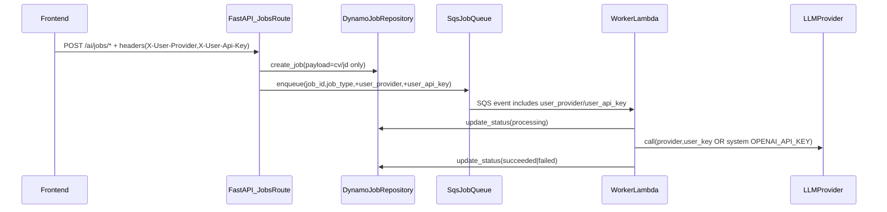

# Phase1: Fix BYOK (OpenAI+Gemini)

## Goal (done means)

- **Frontend-sent BYOK headers are honored**: `X-User-Provider` + `X-User-Api-Key` flow from request → SQS → worker → LLM call.
- **No persistence of raw user keys** in DynamoDB job records.
- **Fallback**: if BYOK headers are missing, jobs run using **system** `OPENAI_API_KEY` (free tier). 
- **Provider support (Phase 1)**: `openai` + `gemini` (Google AI Studio API key).

## Non-goals / constraints

- No infra migration (SST, storage changes, etc.).
- Do not log raw API keys (or CV/job text); log only presence/lengths.
- Preserve async jobs API contract and paths.

## Data flow (target)

## Implementation plan (SOLID/SRP)

### 1) Centralize BYOK header parsing (DI) + validation

- Update [`/Users/nathangurfinkel/repos/cv-app-ng-ai-service/app/utils/security.py`](/Users/nathangurfinkel/repos/cv-app-ng-ai-service/app/utils/security.py)
- Add a FastAPI dependency like `get_user_llm_config(...)` that reads:
    - `X-User-Provider` (must be `openai` or `gemini`)
    - `X-User-Api-Key`
- Validation rules:
    - If **both headers absent** → return `None` (free tier fallback path).
    - If **only one present** → raise `HTTPException(400)` with clear message.
    - If provider is unknown → `HTTPException(400)`.
    - Enforce reasonable max lengths (e.g. 512) and trim whitespace.

### 2) Introduce `llm_factory.py` to build provider clients from an explicit api_key

- Add new file [`/Users/nathangurfinkel/repos/cv-app-ng-ai-service/app/services/llm_factory.py`](/Users/nathangurfinkel/repos/cv-app-ng-ai-service/app/services/llm_factory.py)
- **OpenAI**: construct `OpenAI(api_key=resolved_key)` where `resolved_key = user_key or settings.OPENAI_API_KEY`.
- **Gemini (AI Studio)**: implement minimal REST caller using existing `httpx` dependency:
    - Endpoint: `POST https://generativelanguage.googleapis.com/v1beta/models/{model}:generateContent?key={api_key}`
    - Map `{system,user}` prompts to `systemInstruction` + `contents`.
    - Parse response text from `candidates[0].content.parts[*].text`.
- Keep provider-specific logic inside this factory to keep `AIService` slim.

### 3) Refactor `AIService` to be key/provider-driven (no env-key requirement at import)

- Refactor [`/Users/nathangurfinkel/repos/cv-app-ng-ai-service/app/services/ai_service.py`](/Users/nathangurfinkel/repos/cv-app-ng-ai-service/app/services/ai_service.py)
- Remove “env key is required” assumptions from `__init__`.
- Route all LLM calls through `llm_factory` with `(provider, api_key)` parameters.
- Ensure exceptions raised **never include** the raw key.

### 4) Update async jobs routes to accept BYOK via DI and pass to SQS only

- Update [`/Users/nathangurfinkel/repos/cv-app-ng-ai-service/app/routes/jobs_routes.py`](/Users/nathangurfinkel/repos/cv-app-ng-ai-service/app/routes/jobs_routes.py)
- Add `Depends(get_user_llm_config)` and pass `user_provider/user_api_key` into `JobsService.create_*`.
- Ensure we do **not** store the api key in Dynamo payload.

### 5) Propagate BYOK in the queue layer

- Update queue abstraction + implementation:
- [`/Users/nathangurfinkel/repos/cv-app-ng-ai-service/app/services/job_queue.py`](/Users/nathangurfinkel/repos/cv-app-ng-ai-service/app/services/job_queue.py)
- [`/Users/nathangurfinkel/repos/cv-app-ng-ai-service/app/services/sqs_job_queue.py`](/Users/nathangurfinkel/repos/cv-app-ng-ai-service/app/services/sqs_job_queue.py)
- Preferred: send `user_provider` + `user_api_key` as **SQS MessageAttributes** (not Dynamo, not logs).

### 6) Worker: read BYOK from SQS and execute with correct provider

- Update [`/Users/nathangurfinkel/repos/cv-app-ng-ai-service/app/worker.py`](/Users/nathangurfinkel/repos/cv-app-ng-ai-service/app/worker.py)
- Extract `user_provider/user_api_key` from the SQS record (message attributes or body).
- For each job, instantiate/use `AIService` in a way that cannot leak keys across invocations.
- Fallback behavior:
    - If **no BYOK headers** → `provider=openai` and use `settings.OPENAI_API_KEY`.
    - If `provider=gemini` → must have `user_api_key` (otherwise fail).
- On missing system key for free-tier path, fail job with a clean `{code,message}`.

### 7) CORS allowlist for BYOK headers

- Update [`/Users/nathangurfinkel/repos/cv-app-ng-ai-service/app/main.py`](/Users/nathangurfinkel/repos/cv-app-ng-ai-service/app/main.py) to allow:
- `X-API-Key`, `X-User-Provider`, `X-User-Api-Key`

### 8) Quick verification steps

- Local dev (or unit-style) verification:
- Create an extract job with OpenAI BYOK headers and confirm it succeeds.
- Create an extract job with Gemini BYOK headers and confirm it succeeds.
- Create an extract job with **no BYOK** and confirm it uses system key.
- Create a job with only one BYOK header and confirm it returns 400.

## Implementation todos

- **byok-security-di**: Add `get_user_llm_config` dependency + validation in `app/utils/security.py`
- **byok-llm-factory**: Add `app/services/llm_factory.py` supporting OpenAI + Gemini(AI Studio)
- **byok-ai-service**: Refactor `app/services/ai_service.py` to use factory per call and support provider/key
- **byok-jobs-routes**: Wire DI into `app/routes/jobs_routes.py` and pass BYOK into enqueue path