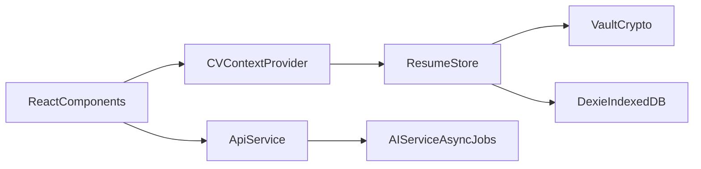

# Phase 3: Local-First Vault (Dexie + Encryption + Stateless-ish Backend)

## Goals (what “done” means)
- **Frontend**: CV data is stored **only on-device** in **IndexedDB** via Dexie, with `resumes.content` **encrypted at rest**.
- **Frontend state**: Replace the current `useState + localStorage` CV persistence with a **Vault data layer** backed by `useLiveQuery`.
- **Backend privacy**: **Stop writing raw CV/job payloads to DynamoDB**. Backend remains async-jobs based, but becomes **process-only** (payload travels via queue, not persisted in DB).
- **API contract unchanged**: Keep existing async jobs routes and shapes so the frontend `ApiService` continues working.

## Key decisions (confirmed)
- **Vault key strategy**: device-bound random 256-bit key stored in `localStorage` (no passphrase UX).
- **Jobs table meaning**: local library of job descriptions (status like `draft|active|archived`).

## Architecture (SOLID boundaries)
- **Storage layer (SRP)**: a small `VaultStore`/`ResumeStore` API used by UI; UI does not depend directly on Dexie.
- **Crypto layer (SRP)**: Web Crypto AES-GCM helpers + key lifecycle (`getOrCreateKey`) isolated from storage.
- **Context layer (SRP)**: `CVContext` orchestrates live queries + exposes actions (`create`, `update`, `setActive`).

## Frontend implementation plan (`cv-app-ng-frontend`)

### 1) Add Dexie dependencies
- Update `[cv-app-ng-frontend/package.json](/Users/nathangurfinkel/repos/cv-app-ng-frontend/package.json)` to include:
  - `dexie`
  - `dexie-react-hooks`

### 2) Create Dexie DB schema
- Add `[cv-app-ng-frontend/src/db/ResuMintDB.ts](/Users/nathangurfinkel/repos/cv-app-ng-frontend/src/db/ResuMintDB.ts)`:
  - `resumes` table: `++id, title, updatedAt` (store encrypted blob in `content`, **not indexed**)
  - `jobs` table: `++id, status` (store job description in `description`, **not indexed**)

### 3) Implement Vault crypto helpers (Web Crypto)
- Add `[cv-app-ng-frontend/src/db/vaultCrypto.ts](/Users/nathangurfinkel/repos/cv-app-ng-frontend/src/db/vaultCrypto.ts)`:
  - `getOrCreateVaultKey()`:
    - generate 32 random bytes
    - persist base64 key in `localStorage` (e.g. `vault_key_v1`)
    - import as `CryptoKey` for AES-GCM
  - `encryptJson()` / `decryptJson()`:
    - AES-GCM with random 12-byte IV
    - store `{ v: 1, iv, ct }` as a JSON string in `resumes.content`

### 4) Build a small storage API (encryption “middleware”)
- Add `[cv-app-ng-frontend/src/storage/resumeStore.ts](/Users/nathangurfinkel/repos/cv-app-ng-frontend/src/storage/resumeStore.ts)`:
  - `listResumesMeta()` returns `{id,title,updatedAt}` without decrypting
  - `getResumeCvData(id)` decrypts `content` → returns `CVData`
  - `createResume({title, cvData})` encrypts and inserts
  - `updateResumeCvData(id, cvData)` encrypts and updates `updatedAt`

(We’ll keep encryption async and explicit here since Web Crypto is promise-based; this is the “middleware” layer that prevents any plaintext `content` from reaching IndexedDB.)

### 5) Add `CVContext` backed by `useLiveQuery`
- Add `[cv-app-ng-frontend/src/contexts/CVContext.tsx](/Users/nathangurfinkel/repos/cv-app-ng-frontend/src/contexts/CVContext.tsx)`:
  - `useLiveQuery` for resume metadata list (dashboard)
  - `useLiveQuery` for active resume’s decrypted `CVData`
  - actions:
    - `ensureDefaultResume()` (create one if none)
    - `createNewResume()`
    - `setActiveResumeId()`
    - `updateCvData(nextCvData)`

### 6) Wire provider at app boundary
- Update `[cv-app-ng-frontend/src/App.tsx](/Users/nathangurfinkel/repos/cv-app-ng-frontend/src/App.tsx)` to wrap app routes with `CVContextProvider`.

### 7) Migrate existing localStorage CV data → Vault (and delete plaintext)
- In `CVContextProvider` on first load:
  - If `localStorage['cv-maker-data']` exists and DB has no resumes:
    - create resume with encrypted content
    - **remove** `cv-maker-data`
  - If `localStorage['cv-maker-raw-input']` has a job description:
    - create a `jobs` row with `status='draft'` (optional but aligns with “job library”)
    - **remove** `cv-maker-raw-input`

### 8) Refactor UI to use context instead of `useCVData` / localStorage
- Replace `useCVData` usage with context in:
  - `[cv-app-ng-frontend/src/components/containers/CVBuilderContainer.tsx](/Users/nathangurfinkel/repos/cv-app-ng-frontend/src/components/containers/CVBuilderContainer.tsx)`
  - `[cv-app-ng-frontend/src/components/CVStepperWizard.tsx](/Users/nathangurfinkel/repos/cv-app-ng-frontend/src/components/CVStepperWizard.tsx)`
- Deprecate or remove:
  - `[cv-app-ng-frontend/src/hooks/useCVData.ts](/Users/nathangurfinkel/repos/cv-app-ng-frontend/src/hooks/useCVData.ts)` (no longer the source of truth)
  - `[cv-app-ng-frontend/src/hooks/useRawInputData.ts](/Users/nathangurfinkel/repos/cv-app-ng-frontend/src/hooks/useRawInputData.ts)` persistence (raw CV text should not be persisted plaintext; we can keep it in component state only)

### 9) Make Dashboard + Editor truly multi-resume
- Update `[cv-app-ng-frontend/src/pages/DashboardPage.tsx](/Users/nathangurfinkel/repos/cv-app-ng-frontend/src/pages/DashboardPage.tsx)`:
  - render resume list from Dexie (metadata)
  - “Create New CV” calls `createNewResume()` and navigates to `/app/editor/{id}`
- Update `[cv-app-ng-frontend/src/pages/EditorPage.tsx](/Users/nathangurfinkel/repos/cv-app-ng-frontend/src/pages/EditorPage.tsx)`:
  - `id === 'new'` → create resume and redirect
  - numeric id → set active resume

## Backend privacy plan (`cv-app-ng-ai-service`)

### 10) Stop persisting job payloads in DynamoDB
- Change repository write path so Dynamo item no longer includes `payload`.
  - Update `[cv-app-ng-ai-service/app/services/job_repository.py](/Users/nathangurfinkel/repos/cv-app-ng-ai-service/app/services/job_repository.py)` and `[cv-app-ng-ai-service/app/services/dynamo_job_repository.py](/Users/nathangurfinkel/repos/cv-app-ng-ai-service/app/services/dynamo_job_repository.py)`.

### 11) Send payload through SQS message instead
- Update `[cv-app-ng-ai-service/app/services/job_queue.py](/Users/nathangurfinkel/repos/cv-app-ng-ai-service/app/services/job_queue.py)` and `[cv-app-ng-ai-service/app/services/sqs_job_queue.py](/Users/nathangurfinkel/repos/cv-app-ng-ai-service/app/services/sqs_job_queue.py)` to include a `payload` field in the message body.
- Update `[cv-app-ng-ai-service/app/services/jobs_service.py](/Users/nathangurfinkel/repos/cv-app-ng-ai-service/app/services/jobs_service.py)` to:
  - write only metadata to Dynamo (job_id, job_type, status, ttl)
  - enqueue payload to SQS

### 12) Update worker to read payload from SQS, not Dynamo
- Update `[cv-app-ng-ai-service/app/worker.py](/Users/nathangurfinkel/repos/cv-app-ng-ai-service/app/worker.py)`:
  - `payload = msg.get('payload') or {}`
  - remove reliance on `item['payload']`

### 13) Add a guard for SQS message size (prevent enqueue failures)
- Add a small validation helper in `[cv-app-ng-ai-service/app/utils/security.py](/Users/nathangurfinkel/repos/cv-app-ng-ai-service/app/utils/security.py)`:
  - compute UTF-8 byte length of the would-be SQS message
  - reject with 400 if too large (especially for `evaluate`/`recommend` where `cv_json` can grow)

## Non-goals (this phase)
- No multi-device sync.
- No passphrase/unlock UI.
- No backend contract changes.

## Implementation todos
- `frontend-add-dexie`: Add Dexie deps and scaffold DB module.
- `frontend-vault-crypto`: Implement AES-GCM crypto + localStorage key.
- `frontend-vault-store`: Implement encrypted ResumeStore + metadata queries.
- `frontend-cv-context`: Build `CVContext` using `useLiveQuery` and refactor components/pages to use it.
- `frontend-migrate-localstorage`: One-time migration + removal of plaintext localStorage CV/raw-input keys.
- `backend-no-dynamo-payload`: Remove Dynamo payload persistence; move payload into SQS and update worker; add message-size guard.
