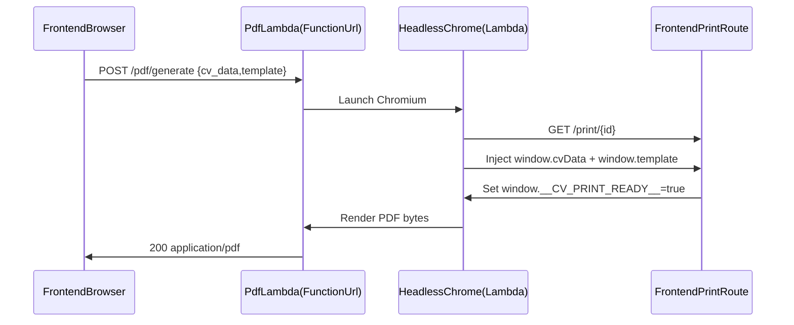

# Phase2 Scale-to-Zero PDF Service (SST v3 + Lambda)

## Goals (what done means)

- Replace the always-on Fargate PDF service with a **scale-to-zero** Lambda deployed via **SST v3**.
- Implement a **Node/TypeScript Lambda** at `packages/functions/src/pdf.ts` using **`puppeteer-core` + `@sparticuz/chromium`**.
- **Port the existing flow** from the current service: load `{FRONTEND_URL}/print/:id` and inject `window.cvData` + `window.template`.
- Configure Lambda with **2048 MB memory** and **30s timeout**.
- Deploy via SST and **output the API URL**.
- Update the frontend to provide a dedicated **`/print/:id`** route that can consume injected data.

## Current behavior to port (reference)

The existing Fargate service does:

```90:136:cv-app-ng-pdf-generator/app/main.py
unique_id = str(uuid.uuid4())
print_url = f"{frontend_url}/print/{unique_id}"

# ... page.goto(print_url) ...

await page.evaluate(f"""
    window.cvData = {json.dumps(cv_data)};
    window.template = '{template}';
""")

await page.wait_for_timeout(2000)

pdf_buffer = await page.pdf(
    format="A4",
    print_background=True,
    margin={
        "top": "0.5in",
        "right": "0.5in",
        "bottom": "0.5in",
        "left": "0.5in"
    }
)
```

Frontend currently calls the PDF service like:

```347:365:cv-app-ng-frontend/src/services/api.ts
static async generatePDF(cvData: CVData, template: string = 'classic'): Promise<Blob> {
  const response = await fetch(`${PDF_SERVICE_URL}/pdf/generate`, {
    method: 'POST',
    headers: {
      'Content-Type': 'application/json',
    },
    body: JSON.stringify({
      cv_data: cvData,
      template: template,
      frontend_url: window.location.origin,
    }),
  });

  if (!response.ok) {
    throw new Error(`HTTP error! status: ${response.status}`);
  }

  return response.blob();
}
```


## Architecture decisions (SOLID + safety)

- **Single responsibility**:
- Lambda handler: request parsing + routing + response formatting.
- Renderer module: Chromium/Puppeteer lifecycle + PDF rendering.
- Validation module: template allowlist + payload size checks.
- **SSRF defense**: ignore client-provided `frontend_url` and use `FRONTEND_URL` (env) as the only source of truth.
- **No PII logging**: log request ids and byte sizes only.
- **Timeout alignment**: use a **Lambda Function URL** (not API Gateway) so a 30s Lambda timeout is actually usable.

## Implementation steps

### 1) Create new SST v3 repo: `cv-app-ng-pdf-generator-lambda/`

- Add `sst.config.ts` at repo root.
- Add `package.json` (workspaces optional, but we’ll match the Blueprint’s `packages/functions` layout).
- Add `packages/functions/` with TypeScript config.

Key files:

- `cv-app-ng-pdf-generator-lambda/sst.config.ts`
- `cv-app-ng-pdf-generator-lambda/package.json`
- `cv-app-ng-pdf-generator-lambda/tsconfig.json`
- `cv-app-ng-pdf-generator-lambda/packages/functions/package.json`
- `cv-app-ng-pdf-generator-lambda/packages/functions/tsconfig.json`

### 2) Implement the PDF Lambda (Puppeteer + Sparticuz Chromium)

- Create `cv-app-ng-pdf-generator-lambda/packages/functions/src/pdf.ts` exporting a handler.
- Support these routes (via Function URL path routing):
- `GET /pdf/templates` → `{ templates: string[] }`
- `POST /pdf/generate` → returns `application/pdf`
- `OPTIONS *` → CORS preflight
- Use `FRONTEND_URL` env var to build print URL: `${FRONTEND_URL}/print/${crypto.randomUUID()}`.
- Render flow:
- launch chromium via `@sparticuz/chromium`
- `page.goto(printUrl, waitUntil: 'networkidle0')`
- `page.evaluate((cvData, template) => { window.cvData=cvData; window.template=template; window.dispatchEvent(new Event('cvdata:updated')); }, cvData, template)`
- wait for frontend readiness flag (e.g. `window.__CV_PRINT_READY__ === true`) instead of a fixed sleep
- `page.pdf({ format: 'A4', printBackground: true, margin: ... })`
- close page/browser in `finally`
- Return the PDF using base64 encoding (`isBase64Encoded: true`) + headers:
- `Content-Type: application/pdf`
- `Content-Disposition: attachment; filename=...`

### 3) Add frontend `/print/:id` route for server-side rendering by Chrome

- Add a new page: `cv-app-ng-frontend/src/pages/PrintPage.tsx`.
- Add a route in `cv-app-ng-frontend/src/App.tsx`: `<Route path="/print/:id" element={<PrintPage />} />`.
- PrintPage behavior:
- render a clean, white page containing a print-friendly CV view
- poll for `window.cvData` and `window.template` (and/or listen for `cvdata:updated`) and then set React state
- when state is ready, set `window.__CV_PRINT_READY__ = true` so Lambda can proceed deterministically
- **Important**: prevent the cookie banner/modals from appearing in the PDF.
- Update `cv-app-ng-frontend/src/components/CookieConsentBanner.tsx` to `return null` when `window.location.pathname.startsWith('/print/')`.

### 4) SST wiring + outputs

- In `sst.config.ts`:
- create one `sst.aws.Function` for PDF generation
- enable `url: true`
- set `memory: 2048` and `timeout: 30`
- set env vars: `FRONTEND_URL`, plus `CORS_ORIGINS` (comma-separated) for response headers
- Add outputs: `{ pdfServiceUrl: pdf.url }`.

### 5) Developer experience / env alignment

- Update `cv-app-ng-frontend/env.example` to include:
- `VITE_PDF_SERVICE_URL=...` (SST output)
- (optional but recommended) `VITE_API_KEY=...` since `src/services/api.ts` expects it
- Add `cv-app-ng-pdf-generator-lambda/README.md` with:
- local dev flow (run frontend + `sst dev`)
- required env vars (`FRONTEND_URL`, `CORS_ORIGINS`)

## Data flow (after migration)




## Risks / gotchas (and how we handle them)

- **Cookie banner polluting PDFs**: explicitly disabled on `/print/*`.
- **Google Fonts external dependency**: `index.html` pulls Montserrat from Google Fonts.